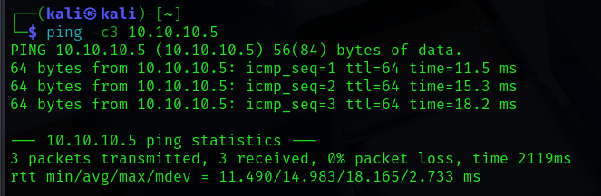
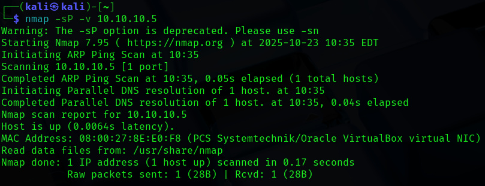
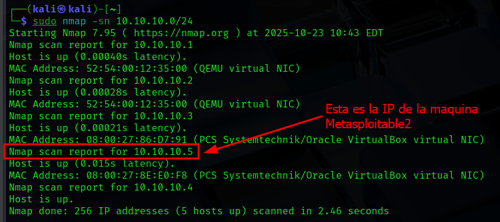
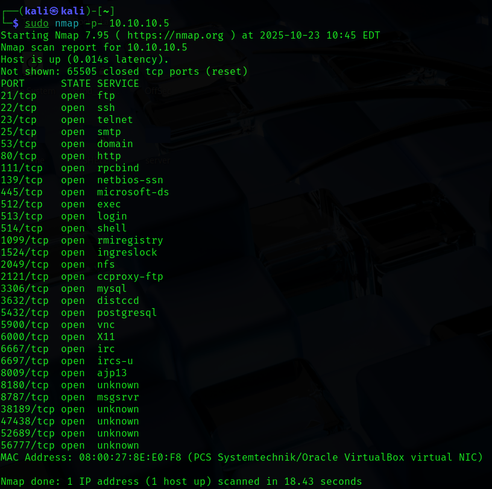
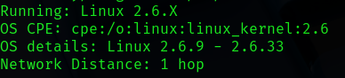
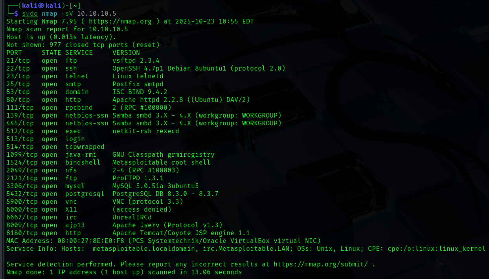
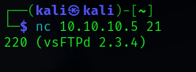
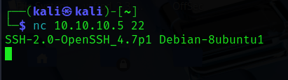
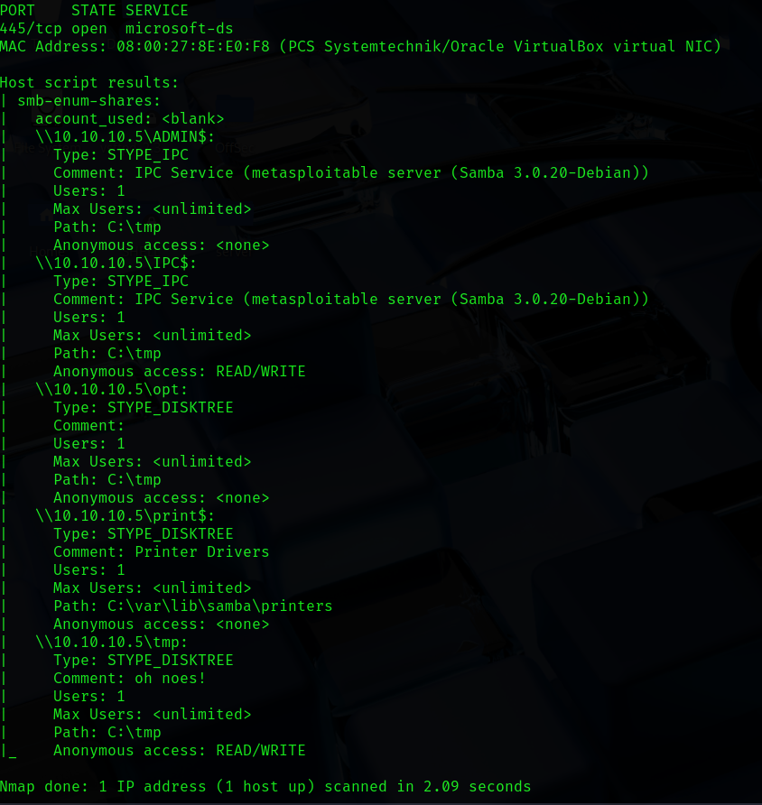

# Escaneo de puertos con Nmap en Metasploitable2

> Laboratorio realizado en un entorno local/controlado con fines educativos. No aplicar estas tecnicas sobre sistemas de terceros sin autorizacion expresa.

## Objetivo

Practicar descubrimiento de hosts, escaneo de puertos y documentacion de servicios expuestos en un entorno de laboratorio con Kali y Metasploitable2.

## Informacion general

- Categoria: Reconocimiento y enumeracion
- Entorno: Kali Linux y maquinas vulnerables de laboratorio
- Formato: documentacion tecnica para portfolio GitHub

## Desarrollo de la practica


### EJERCICIOS ESCANEO DE PUERTOS NMAP

Prerrequisitos

Descargar la imagen de máquina virtual Metasploitable2: https://sourceforge.net/projects/metasploitable/files/Metasploitable2/


### Seguir la guía de instalación de Metasploitable2

https://www.hacking-tutorial.com/tips-and-trick/install-metasploitable-on-virtual-box/

En VirtualBox, entrar en "Configuración-Red" de Metasploitable2 y asignarle una red NAT


### Entrar en las máquinas virtuales y comprobar

Dirección IP de Kali Linux

10.10.10.4

Dirección IP de Metasploitable2

10.10.10.5

Credenciales: msfadmin/msfadmin

Hacer un ping para comprobar la conectividad entre ellas

Ejercicio 1

Descubre los equipos conectados a la red NAT 10.0.2.X/255.255.255.0 o /24 Comprobar que la IP de la máquina Metasploitable2 aparece.

Ejercicio 2

Escanear los puertos de la máquina Metasploitable2

Ejercicio 3

Realizar un esquema de la siguiente forma: PUERTO - ESTADO - SERVICIO - QUE HACE ESTE SERVICIO para todos los puertos del equipo Buscar información de los puertos y servicios según el resultado de Nmap en Google.

NOTA: El objetivo es entender qué servicios están levantados en la máquina y para qué sirven.


### PUERTO/PROTOCOLO ESTADO SERVICIO QUÉ HACE EL SERVICIO

21/tcp open ftp Transferencia de archivos (subida/descarga).

22/tcp open ssh Acceso remoto seguro (administración remota cifrada).

23/tcp open telnet Acceso remoto sin cifrar (consola de texto; inseguro).

25/tcp open smtp Envío de correo electrónico (servidor de salida).

53/tcp open domain (dns) Resolución de nombres de dominio a IPs.

80/tcp open http Servidor web (HTTP, no cifrado).

111/tcp open rpcbind Asocia servicios RPC a puertos (sistemas Unix/Linux).

139/tcp open netbios-ssn NetBIOS Session Service (Windows file sharing).

445/tcp open microsoft-ds SMB directo (compartición de archivos/impresoras en Windows).

512/tcp open exec Servicio remoto antiguo para ejecutar comandos (inseguro).

513/tcp open login Servicio de login remoto antiguo (inseguro).

514/tcp open shell Shell remoto sin cifrar (inseguro).

1099/tcp open rmiregistry Registro RMI de Java (objetos remotos/servicios distribuidos).

1524/tcp open ingreslock Puerto asociado a backdoors/exploits antiguos (potencialmente peligroso).

2049/tcp open nfs Network File System (compartición de ficheros Unix/Linux).

2121/tcp open ccproxy-ftp FTP alternativo/proxy FTP.

3306/tcp open mysql Servidor de base de datos MySQL/MariaDB.

3632/tcp open distccd Servicio de compilación distribuida (puede ser vulnerable).

5432/tcp open postgresql Servidor de base de datos PostgreSQL.

5900/tcp open vnc Control remoto del escritorio (VNC).

6000/tcp open X11 Servidor X (display remoto).

6667/tcp open irc Chat IRC.

6697/tcp open ircs-u IRC sobre TLS/SSL.

8009/tcp open ajp13 AJP (connector Tomcat/Apache).

8180/tcp open unknown Puerto alterno web/administración - identificar con nmap -sV.

8787/tcp open msgsrvr Servicio de mensajería/servidor específico de aplicación.

38189/tcp open unknown Puerto no estándar - investigar.

47438/tcp open unknown Puerto dinámico/privado - investigar.

52689/tcp open unknown Puerto efímero/propietario - investigar.

56777/tcp open unknown Puerto no registrado - posible backdoor o servicio propio.

Ejercicio 4

¿Qué versión de SO utiliza?

```bash

nmap -O 10.10.10.5

```

Ejercicio 5

Completa el esquema del ejercicio 3 con la versión de los servicios desplegados. PUERTO - ESTADO - SERVICIO - VERSION DEL SERVICIO

Ejercicio 6

Comprueba manualmente la versión de dos de los servicios levantados utilizando nc, telnet o navegador web.

NOTA: Se puede establecer una conexión con el puerto del servicio de manera manual, utilizando diferentes herramientas como netcat o telnet (independientemente del cliente) o con clientes propios (navegador web, cliente ssh). De esta manera contrastamos de manera manual las versiones detectadas por Nmap:

```bash

nc 10.10.10.5 21

nc 10.10.10.5 22

```

Ejercicio 7


### Utiliza un script NSE para extraer más información de un servicio en concreto

ls /usr/share/nmap/scripts aquí Podemos ver todos los archivos .nse disponibles.

ls /usr/share/nmap/scripts/ | grep "servicio"

Ejemplo: Puerto 80/443 → busca scripts con grep "http"

Puerto 22 → grep "ssh"

Puerto 445 → grep "smb"

```bash

nmap --script smb-enum-shares -p 445 10.10.10.5

```

## Evidencias visuales

### Captura 01



### Captura 02



### Captura 03



### Captura 04



### Captura 05



### Captura 06



### Captura 07



### Captura 08



### Captura 09




## Medidas defensivas y aprendizaje

- Mantener servicios actualizados y eliminar software obsoleto.
- Exponer solo los puertos necesarios y aplicar reglas de firewall.
- Usar segmentacion de red para aislar maquinas vulnerables o servicios criticos.
- Revisar logs de autenticacion, red y aplicacion tras cualquier prueba.
- Sustituir servicios inseguros por alternativas cifradas y soportadas.
- Aplicar el principio de minimo privilegio en usuarios, servicios y demonios.
- Documentar cada hallazgo con evidencia, impacto y recomendacion.

## Notas

- Se ha eliminado informacion personal y marcas de confidencialidad del documento original.
- Las rutas, IPs y credenciales que aparecen pertenecen a entornos de laboratorio o maquinas vulnerables preparadas para practica.
- Este README es la version limpia para GitHub; conserva los documentos originales solo en privado.
