# Analisis de vulnerabilidades con OpenVAS en Metasploitable2

> Laboratorio realizado en un entorno local/controlado con fines educativos. No aplicar estas tecnicas sobre sistemas de terceros sin autorizacion expresa.

## Objetivo

Documentar un analisis de vulnerabilidades sobre Metasploitable2, priorizando hallazgos y medidas de mitigacion.

## Informacion general

- Categoria: Gestion de vulnerabilidades
- Entorno: Kali Linux y maquinas vulnerables de laboratorio
- Formato: documentacion tecnica para portfolio GitHub

## Desarrollo de la practica

Escaneo Completo

Metasploitable2

10.10.10.5

OpenVAS

Tiempo de finalización del escaneo: 28/10/2025 16:45-19:30 PM

Total de vulnerabilidades: 664

Severidad High: (7.0 - 10.0)

Vulnerabilidades (high) encontradas 21 = 11.4 %

Distributed Ruby (dRuby/DRb) - Multiple RCE Vulnerabilities

Tue, Oct 28, 2025 9:18 PM

Host / puerto: 10.10.10.5 : 8787 Severidad (OpenVAS): 10.0 (High)

CVE(s) asociadas: CVE-2011-5330, CVE-2011-5331

DRb (Distributed Ruby) expone objetos y métodos para ejecución remota; versiones vulnerables permiten que un atacante envíe datos que se deserializan o se evalúan en el contexto del servidor (por ejemplo mediante instance_eval o llamadas peligrosas), provocando la ejecución de código arbitrario si el servicio está accesible desde la red.

### Mitigaciones

Deshabilitar el servicio DRb si no es necesario (detener y desactivar el daemon).

Restringir el acceso de red al puerto (bloquear 8787 en el firewall o permitir solo IPs de confianza).

Actualizar Ruby/DRb a versiones parcheadas que corrijan las vulnerabilidades.

Configurar el servicio para que enlace solo a localhost si solo se necesita acceso local.

Colocar el servicio detrás de túneles seguros (SSH/VPN) y aplicar autenticación/ACLs estrictas si debe permanecer accesible.

Revisar logs y realizar análisis forense si hubo exposición para detectar posibles compromisos.

rlogin Passwordless Login

Tue, Oct 28, 2025 9:08 PM

Host / puerto: 10.10.10.5 : 513 Severidad (OpenVAS): 10.0 (High)

CVE(s) asociadas: CVE-1999-0651.

rlogin transmite credenciales y datos en texto claro y, en configuraciones débiles, puede permitir inicios de sesión sin contraseña o ser eludido por suposiciones sobre direcciones IP (IP spoofing) o ataques de tipo ARP/TCP sequence guessing, lo que permite a un atacante obtener acceso remoto o capturar credenciales en la red.

Deshabilitar rlogin si no es necesario y remover paquetes/servicios relacionados.

Sustituir por soluciones seguras (SSH con claves y configuración fuerte).

Bloquear el puerto 513 en firewalls perimetrales y segmentar la red para que sólo hosts administrativos puedan comunicarse con servicios legados.

Revisar logs para conexiones inusuales y forenses si se detectó acceso no autorizado.

Aplicar reglas de prevención de spoofing (anti-spoofing, control de ARP) en la red local.

TWiki XSS and Command Execution Vulnerabilities

Tue, Oct 28, 2025 9:16 PM

Host / puerto: 10.10.10.5 : 80 Severidad (OpenVAS): 10.0 (High)

CVE(s) asociadas: CVE-2008-5304, CVE-2008-5305, CVE-2012-0979 (varias versiones/funcionalidades de TWiki presentan XSS y en algunos casos ejecución de comandos).

Algunas versiones de TWiki contienen fallos de validación/saneamiento en variables y funciones (por ejemplo %URLPARAM{}, %SEARCH{} y campos de perfil) que permiten a un atacante inyectar JavaScript (XSS) o, en casos concretos de ciertas macros, provocar ejecución de comandos en el servidor si el contenido malicioso es interpretado por componentes inseguros. Esto puede llevar a escalada de privilegios, robo de sesiones o ejecución remota según la configuración y extensiones instaladas.

Actualizar TWiki a la versión parcheada más reciente que corrija las CVE mencionadas.

Aplicar filtros de entrada/escape de salida en plantillas y macros, evitando evaluar contenido proporcionado por usuarios.

Restringir subida/edición de contenido a usuarios autenticados y con permisos mínimos necesarios.

Revisar/extender WAF reglas para detectar inyecciones XSS/command injection hacia el servicio web.

Realizar pruebas de seguridad (fuzzing/sanitización) tras cambios y revisar logs de acceso para actividades sospechosas.

The rexec service is running

Tue, Oct 28, 2025 9:14 PM

Host / puerto: 10.10.10.5 : 512 Severidad (OpenVAS): 10.0 (High)

CVE(s) asociadas: CAN/CVE-1999-0618 (registro antiguo que indica riesgo por rexec activo).

El servicio rexec (remote exec) permite la ejecución remota de comandos en el host usando credenciales que a menudo se transmiten sin cifrado y con autenticación débil; su presencia expone el sistema a suplantación, interceptación de credenciales y accesos remotos no autorizados, además de que es un servicio obsoleto y peligroso en entornos modernos.

Detener y desinstalar el servicio rexec si no es estrictamente necesario.

Si requiere compatibilidad, usar alternativas seguras como SSH con autenticación por clave y configuración de tiempo de espera/denegación de root.

Bloquear el puerto 512 en firewalls y aplicar segmentación de red.

Revisar configuraciones de cuentas con privilegios y cambiar contraseñas potencialmente comprometidas.

Monitorizar logs para intentos de acceso y realizar análisis forense si hay indicios de abuso.

Operating System (OS) End of Life (EOL) Detection

Host / puerto: 10.10.10.5 : general/tcp Severidad (OpenVAS): 10.0 (High)

CVE(s) asociadas: Ninguna específica - hallazgo indica que el sistema operativo ha alcanzado EOL (sin soporte/patches).

Un sistema operativo en EOL ya no recibe parches de seguridad ni actualizaciones del proveedor; esto significa que vulnerabilidades nuevas y conocidas no serán corregidas, exponiendo el host a explotaciones ya conocidas y a futuras vulnerabilidades sin posibilidad de mitigación oficial, incrementando significativamente el riesgo operativo y de seguridad.

Planificar y ejecutar migración a una versión soportada del sistema operativo con parches de seguridad.

Si la migración no es inmediata, aplicar controles compensatorios: segmentación estricta, reducir servicios expuestos, aplicar WAF/IPS y endurecer configuraciones.

Asegurar copias de seguridad y un plan de recuperación ante incidentes antes de cualquier actualización mayor.

Evaluar software de terceros por compatibilidad con versiones soportadas y actualizar/retirar software obsoleto.

Mantener inventario y política de ciclo de vida para evitar EOL inadvertido en el futuro.

Apache Tomcat AJP RCE Vulnerability (Ghostcat) - Active Check

Tue, Oct 28, 2025 9:28 PM

Host / puerto: 10.10.10.5 : 8009 Severidad (OpenVAS): 9.8 (High)

CVE(s) asociadas: CVE-2020-1938 (Apache Tomcat AJP request injection / "Ghostcat").

Si el conector AJP de Tomcat está habilitado y accesible a un atacante no confiable, se pueden enviar peticiones AJP que permitan leer archivos webapp desprotegidos o, en escenarios con configuraciones vulnerables, inyectar solicitudes que conduzcan a ejecución remota o inclusión de archivos sensibles; el riesgo depende de la versión de Tomcat y de si el conector escucha en interfaces accesibles.

Aplicar parches/actualizar Apache Tomcat a versiones que corrijan CVE-2020-1938.

Deshabilitar el conector AJP si no se usa; si se necesita, configurar address="127.0.0.1" o restringir binding a interfaces internas únicamente.

Proteger el puerto 8009 con firewall y permitir sólo conexiones desde proxies/reverse proxies de confianza.

Configurar autenticación/ACL y revisar secret en configuraciones AJP si la versión lo soporta.

Revisar logs para accesos anómalos y realizar auditoría de archivos leídos/modificados.

vsftpd Compromised Source Packages Backdoor Vulnerability

Host / puerto: 10.10.10.5 : 21 Severidad (OpenVAS): 9.8 (High)

CVE(s) asociadas: CVE-2011-2523 (vsftpd 2.3.4 backdoor in compromised source distribution).

La distribución vsftpd-2.3.4 que estuvo comprometida incluía un backdoor que, al activarse mediante una conexión FTP específica, abría una shell remota (normalmente en el puerto 6200), permitiendo ejecución de comandos por un atacante que se conectara usando la técnica del backdoor; esto no es un fallo del código legítimo sino de la fuente distribuida comprometida.

Verificar la versión instalada de vsftpd y eliminar/rehabilitar cualquier instalación proveniente de vsftpd-2.3.4 comprometida.

Actualizar vsftpd a una versión segura o reinstalar desde fuentes oficiales verificadas.

Buscar y cerrar shells abiertos (por ejemplo conexiones en el puerto 6200) y revisar procesos/usuarios sospechosos.

Cambiar credenciales/llaves potencialmente comprometidas y auditar integridad de binarios (hashes).

Bloquear o monitorear el puerto 21/6200 y revisar logs FTP para actividad anómala.

MySQL / MariaDB Default Credentials (MySQL Protocol)

Tue, Oct 28, 2025 9:17 PM

Host / puerto: 10.10.10.5 : 3306 Severidad (OpenVAS): 9.8 (High)

CVE(s) asociadas: Ejemplos históricos relacionados con credenciales por defecto: CVE-2001-0645, referencias de configuraciones con credenciales por defecto (varía por producto).

Servicios MySQL/MariaDB con credenciales por defecto o sin contraseña permiten acceso remoto total a las bases de datos, lo que posibilita lectura/alteración/ eliminación de datos, ejecución de comandos a través de funcionalidades que permiten ejecutar código o escalar privilegios, y movimiento lateral dentro de la red si no se restringe el acceso.

Cambiar todas las cuentas con contraseñas por defecto; establecer contraseñas fuertes y rotación periódica.

Deshabilitar acceso remoto al puerto 3306 si no es necesario; bind a 127.0.0.1 o usar listas blancas de IP.

Habilitar autenticación fuerte, roles/privilegios mínimos y logging de auditoría.

Asegurar conexiones (túneles SSH, SSL/TLS) y segmentar la base de datos en la red.

Revisar usuarios y privilegios para identificar cuentas innecesarias y rotar credenciales si existió exposición.

Host / puerto: 10.10.10.5 : 6200 Severidad (OpenVAS): 9.8 (High)

CVE(s) asociadas: CVE-2011-2523 (backdoor opens shell on port 6200 cuando se usa la vsftpd 2.3.4 comprometida).

La presencia de una conexión/listening en el puerto 6200 suele indicar que la backdoor incluida en la versión comprometida vsftpd-2.3.4 se activó y abrió una shell remota; un atacante puede conectar a esa shell para ejecutar comandos arbitrarios con los privilegios del servicio, comprometiendo el servidor.

Terminar inmediatamente cualquier proceso/shell escuchando en el puerto 6200 y bloquear el puerto en el firewall.

Identificar la procedencia del paquete vsftpd instalado; reinstalar desde fuentes oficiales y actualizar a una versión segura.

Revisar integridad del sistema (binaries, crontabs, cuentas), cambiar credenciales y buscar persistencia.

Hacer análisis forense si hay indicios de acceso y asumir posible compromiso hasta confirmar lo contrario.

Implementar detección y alertas para puertos anómalos y actividad de FTP inusual.

PHP < 5.3.13, 5.4.x < 5.4.3 Multiple Vulnerabilities - Active Check

Tue, Oct 28, 2025 9:25 PM

Host / puerto: 10.10.10.5 : 80 Severidad (OpenVAS): 9.8 (High)

CVE(s) asociadas: Varias según versión; entre las citadas históricamente están CVE-2012-1823, CVE-2012-2311, CVE-2012-2335, CVE-2012-2336 (conjunto de vulnerabilidades en versiones antiguas de PHP).

Versiones antiguas de PHP (anteriores a las versiones indicadas) contienen múltiples fallos críticos - incluidos desbordamientos, inyección vía parámetros CGI, y fallos en funciones internas - que pueden conducir a ejecución de código, escalada de privilegios o divulgación de información; su exposición en servidores web permite que atacantes remotos exploten estas fallas contra aplicaciones PHP sin parchear.

Actualizar PHP a una versión soportada y parcheada inmediatamente.

Revisar y actualizar todas las aplicaciones PHP y extensiones para compatibilidad con versiones modernas.

Si la actualización inmediata no es posible, aplicar mitigaciones temporales: deshabilitar funciones peligrosas (exec, system, shell_exec, etc.), endurecer php.ini (display_errors=Off, expose_php=Off), y usar WAF reglas para bloquear payloads conocidos.

Realizar escaneo de aplicaciones para identificar código vulnerable y aplicar correcciones.

Habilitar registros detallados y monitoreo para detección temprana de explotación.

DistCC RCE Vulnerability (CVE-2004-2687)

Host / puerto: 10.10.10.5 : 3632 Severidad (OpenVAS): 9.3 (High)

CVE(s) asociadas: CVE-2004-2687

distcc (daemon de compilación distribuida) permite que trabajos de compilación enviados por la red se ejecuten en el servidor; si está mal configurado (escuchando en interfaces accesibles sin restricciones) un atacante puede enviar entradas manipuladas que provoquen la ejecución de comandos arbitrarios en el host, obteniendo ejecución remota de código con los permisos del servicio.

Deshabilitar distcc si no es necesario y desinstalar paquetes asociados.

Limitar binding del servicio a localhost o a interfaces internas únicamente.

Restringir el acceso por firewall (bloquear el puerto 3632 desde redes no confiables).

Aplicar parches/actualizaciones y utilizar distribuciones/paquetes oficiales.

Revisar logs y detectar actividad/ejecuciones inusuales; considerar análisis forense si hubo exposición.

Sustituir la funcionalidad por flujos de compilación seguros (CI/CD con túneles y autenticación).

VNC Brute Force Login

Host / puerto: 10.10.10.5 : 5900 Severidad (OpenVAS): 9.0 (High)

CVE(s) asociadas: Ninguna específica (este hallazgo indica posibilidad de fuerza bruta sobre autenticación VNC)

Los servidores VNC protegen acceso remoto por contraseña; si las contraseñas son débiles o no existen mecanismos de bloqueo, un atacante puede realizar intentos masivos (brute force) para adivinar credenciales y tomar control remoto del escritorio, con riesgo de acceso completo al entorno de usuario/servicio.

Forzar contraseñas fuertes y únicas para todas las instancias VNC.

Habilitar límites/lockout tras intentos fallidos y alertas de autenticación.

Encapsular VNC dentro de túneles seguros (SSH/VPN) y no exponerlo directamente a redes no confiables.

Restringir acceso por firewall y permitir solo IPs o rangos de administración.

Habilitar logging y monitorización para detectar ataques de fuerza bruta.

PostgreSQL Default Credentials (PostgreSQL Protocol)

Host / puerto: 10.10.10.5 : 5432 Severidad (OpenVAS): 9.0 (High)

CVE(s) asociadas: Ninguna específica (indica cuentas con credenciales por defecto o sin contraseña)

Una base de datos PostgreSQL accesible con credenciales por defecto o sin contraseña permite a atacantes autenticarse y obtener acceso completo a las bases de datos, pudiendo leer, modificar o eliminar datos, y potencialmente escalar o pivotar dentro de la red.

Cambiar todas las cuentas con contraseñas por defecto; imponer contraseñas fuertes y políticas de rotación.

Restringir binding de PostgreSQL a 127.0.0.1 o a IPs permitidas; bloquear puerto 5432 desde redes no confiables.

Aplicar el principio de privilegios mínimos en roles/usuarios de la DB.

Habilitar cifrado en tránsito (SSL/TLS) y registrar auditoría de accesos.

Revisar usuarios/roles existentes y eliminar cuentas innecesarias; rotar credenciales si hubo exposición.

UnrealIRCd Authentication Spoofing Vulnerability

Tue, Oct 28, 2025 9:09 PM

Host / puerto: 10.10.10.5 : 6697 Severidad (OpenVAS): 8.1 (High)

CVE(s) asociadas: CVE-2016-7144

En ciertas versiones de UnrealIRCd existe un fallo en la validación de parámetros de autenticación que permite a un atacante falsificar huellas de certificado o parámetros AUTHENTICATE, con lo que puede suplantar la identidad de otro usuario y obtener privilegios o acceso no autorizado en el servicio IRC.

Actualizar UnrealIRCd a la versión parcheada (versiones corregidas disponibles).

Si no es posible actualizar inmediatamente, restringir el acceso al servicio (firewall, ACLs) y deshabilitar módulos no necesarios.

Aplicar controles de conexión (lista blanca de IPs, certificados válidos) y endurecer configuración de SASL/autenticación.

Monitorizar logs de autenticación y eventos inusuales; realizar auditoría de cuentas y privilegios.

FTP Brute Force Logins With Default Credentials Reporting (puerto 2121)

Host / puerto: 10.10.10.5 : 2121 Severidad (OpenVAS): 7.5 (High)

CVE(s) asociadas: Ninguna específica (indica detección de intentos de fuerza bruta o credenciales por defecto)

Servicios FTP con cuentas débiles o por defecto son susceptibles a ataques de fuerza bruta; un atacante que obtenga credenciales puede transferir, borrar o modificar archivos, y usar el servicio para moverse lateralmente o subir webshells.

Eliminar cuentas con contraseñas por defecto; forzar contraseñas robustas.

Habilitar límites y bloqueos tras intentos fallidos, y alertas de seguridad.

Migrar a protocolos seguros (SFTP/FTPS) y no exponer FTP sin cifrado a redes públicas.

Restringir por firewall y segmentar el servicio; vigilar logs y actividad de archivos.

FTP Brute Force Logins With Default Credentials Reporting (puerto 21)

Host / puerto: 10.10.10.5 : 21 Severidad (OpenVAS): 7.5 (High)

CVE(s) asociadas: Ninguna específica (similar al hallazgo anterior)

Servicios FTP en el puerto estándar presentan los mismos riesgos de fuerza bruta y credenciales débiles que el caso anterior; exposición permite manipulación de archivos y posible persistencia del atacante en el sistema.

Eliminar/fortalecer cuentas por defecto; forzar políticas de contraseña.

Implementar mitigación contra fuerza bruta, usar FTPS/SFTP en lugar de FTP plano.

Bloquear/limitar acceso desde internet y aplicar segmentación.

Auditar logs y revisar integridad de archivos subidos/modificados.

Java RMI Server Insecure Default Configuration RCE Vulnerability - Active Check

Host / puerto: 10.10.10.5 : 1099 Severidad (OpenVAS): 7.5 (High)

CVE(s) asociadas: Puede corresponder a varias exposiciones relacionadas con RMI inseguro; ejemplos en el ecosistema incluyen CVE-2011-3556 y reportes de ejecución remota asociados a cargas remotas en RMI (correspondencia depende del software afectado)

Al usar una configuración por defecto, el servicio Java RMI puede permitir la carga de clases desde URLs remotas o invocar métodos que descargan código no confiable, lo que permite a un atacante provocar la ejecución remota de código en la JVM si el endpoint RMI está accesible y sin restricciones.

Deshabilitar o restringir el servicio RMI si no es necesario.

Configurar políticas de seguridad de la JVM (SecurityManager/Policy) y evitar permitir carga de clases desde URLs remotas.

Restringir acceso al puerto 1099 por firewall y permitir solo hosts de confianza/VPN.

Actualizar componentes que exponen RMI y aplicar parches recomendados por el proveedor.

Monitorizar y revisar auditoría de llamadas RMI y procesos Java sospechosos.

rsh Unencrypted Cleartext Login

Host / puerto: 10.10.10.5 : 514 Severidad (OpenVAS): 7.5 (High)

CVE(s) asociadas: Ninguna específica (indica uso de rsh/rlogin que transmiten credenciales en claro)

El servicio rsh transmite autenticación y datos en texto claro y usa mecanismos de confianza por host poco fiables; su uso permite intercepción de credenciales y ejecución remota sin protección adecuada, exponiendo el sistema a suplantación y accesos no autorizados.

Deshabilitar y desinstalar rsh/rlogin si no se requieren.

Reemplazar por SSH con autenticación por clave y configuración segura.

Bloquear puertos rsh/rlogin en el firewall y segmentar la red.

Revisar cuentas y cambiar contraseñas; monitorizar accesos remotos.

The rlogin service is running

Host / puerto: 10.10.10.5 : 513 Severidad (OpenVAS): 7.5 (High)

CVE(s) asociadas: Ninguna específica (indica servicio rlogin activo con riesgos inherentes)

La presencia del servicio rlogin indica que se permiten conexiones remotas con métodos de autenticación inseguros o sin cifrado; esto facilita accesos no autorizados, suplantación de identidad por IP y exposición de credenciales.

## Evidencias visuales

### Captura 01

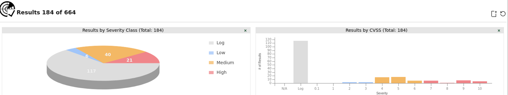

### Captura 02

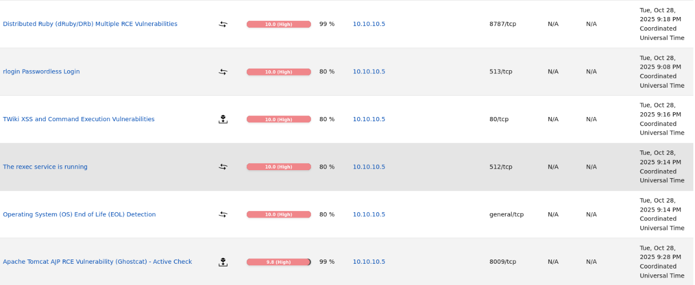

### Captura 03

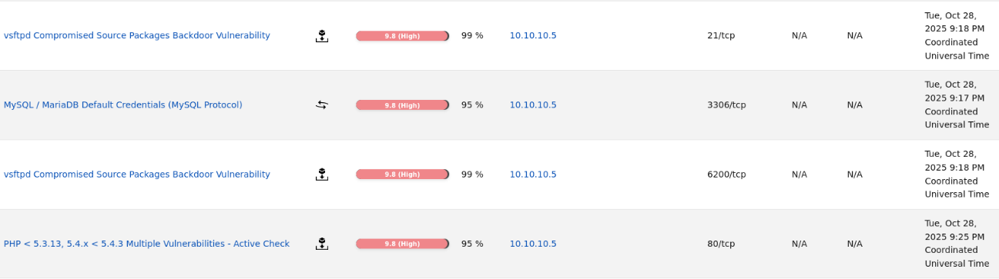

### Captura 04

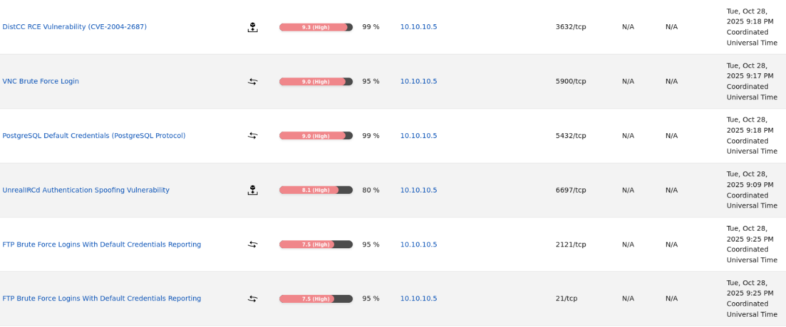

### Captura 05

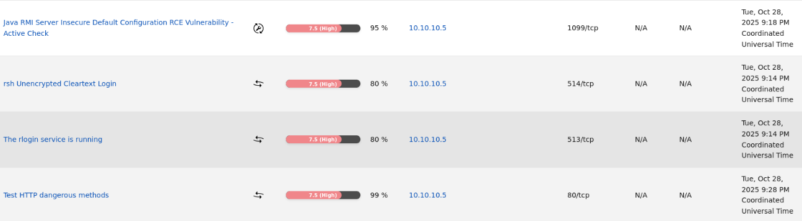

### Captura 06

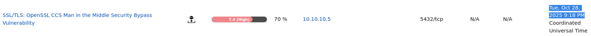

### Captura 07

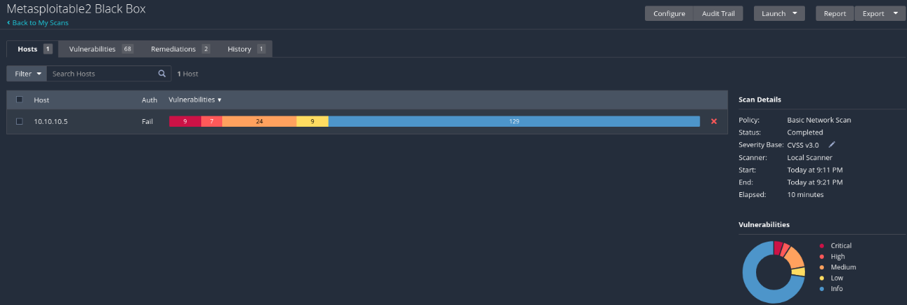

### Captura 08

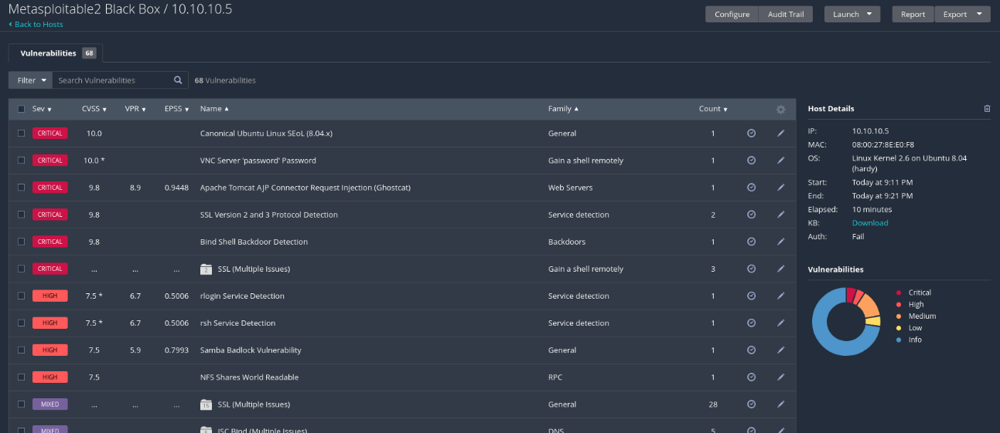

### Captura 09

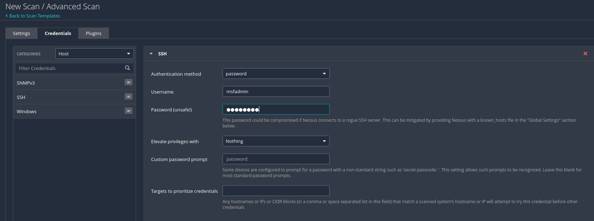

### Captura 10

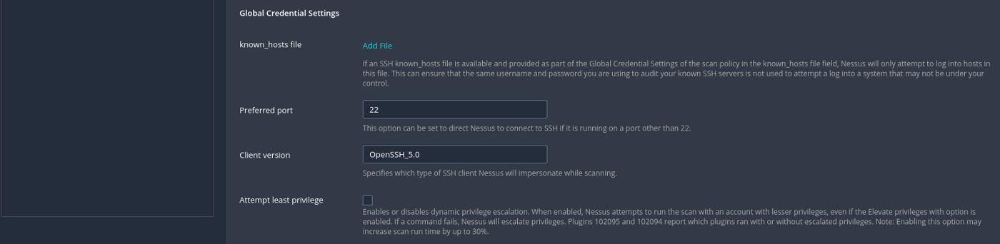

### Captura 11

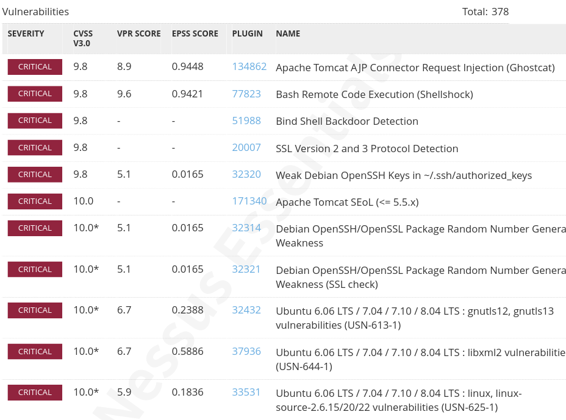

### Captura 12

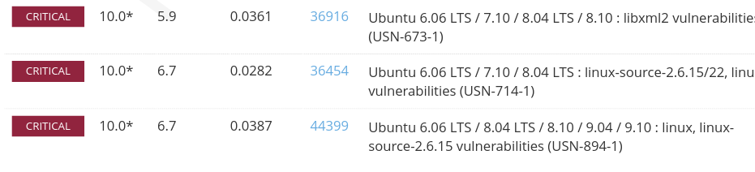

### Captura 13

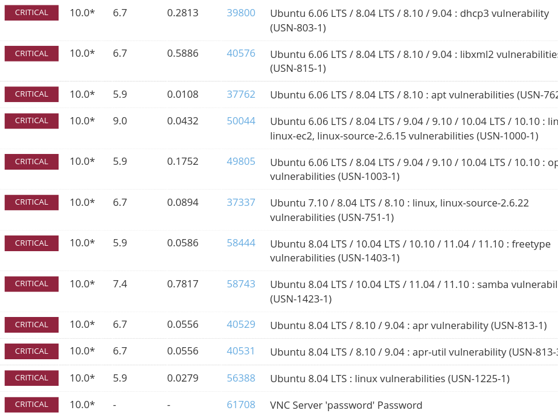

### Captura 14

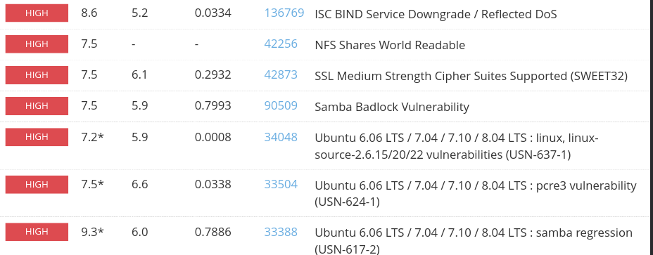

### Captura 15

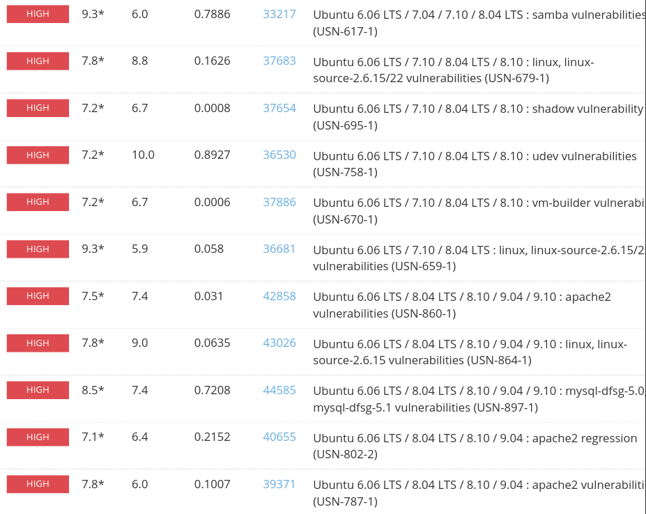

## Medidas defensivas y aprendizaje

- Mantener servicios actualizados y eliminar software obsoleto.
- Exponer solo los puertos necesarios y aplicar reglas de firewall.
- Usar segmentacion de red para aislar maquinas vulnerables o servicios criticos.
- Revisar logs de autenticacion, red y aplicacion tras cualquier prueba.
- Sustituir servicios inseguros por alternativas cifradas y soportadas.
- Aplicar el principio de minimo privilegio en usuarios, servicios y demonios.
- Documentar cada hallazgo con evidencia, impacto y recomendacion.

## Notas

- Se ha eliminado informacion personal y marcas de confidencialidad del documento original.
- Las rutas, IPs y credenciales que aparecen pertenecen a entornos de laboratorio o maquinas vulnerables preparadas para practica.
- Este README es la version limpia para GitHub; conserva los documentos originales solo en privado.
