# pfSense + Snort - Implementación de una DMZ de laboratorio

> Laboratorio/documentación realizada en entorno local o controlado con fines educativos. No ejecutar estas técnicas contra sistemas ajenos o sin autorización.


## Objetivo

Construir una arquitectura de laboratorio con pfSense como firewall, una red DMZ y Snort para inspección/detección de tráfico.

## Entorno

| Elemento | Descripción |
|---|---|
| Firewall | pfSense |
| IDS/IPS | Snort |
| Atacante/control | Kali Linux |
| Víctima/lab | Metasploitable2 |
| Red privada | `192.168.100.0/24` |

## 1. Segmentación de red

La práctica separa la red WAN/puente de una red NAT privada para evitar conflictos de subred y permitir que pfSense enrute e inspeccione el tráfico.

## 2. Configuración de máquinas

- Kali en segmento de administración/laboratorio.
- Metasploitable2 en red interna/DMZ.
- pfSense con interfaces diferenciadas para enrutar entre zonas.

## 3. Reconocimiento inicial

```bash
nmap -sV -p- 192.168.1.142
```

Este escaneo sirve para documentar servicios expuestos antes de aplicar controles defensivos.

## 4. Instalación y uso de pfSense

La práctica incluye descarga de ISO, configuración de máquina virtual, instalación y comprobación de conectividad entre segmentos.

## 5. Snort

Snort añade capacidad de inspección y alerta sobre tráfico sospechoso. En un laboratorio permite validar reglas y observar cómo se comporta el tráfico ofensivo cuando atraviesa el firewall.

## Medidas defensivas aprendidas

- Separar redes por función.
- Evitar que máquinas vulnerables estén en la misma red que el equipo principal.
- Registrar y analizar tráfico entre segmentos.
- Aplicar reglas de firewall restrictivas.
- Usar IDS/IPS como capa adicional, no como sustituto del hardening.

## Evidencias visuales


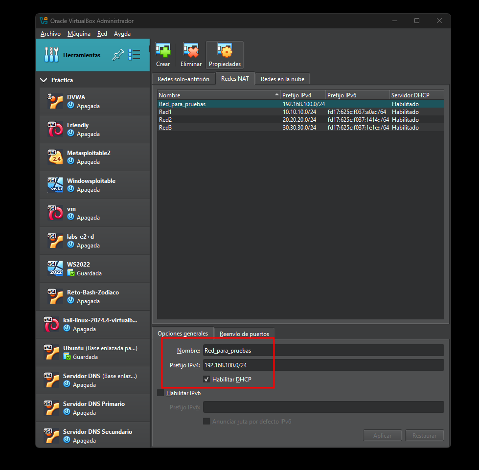

*Captura 1.*

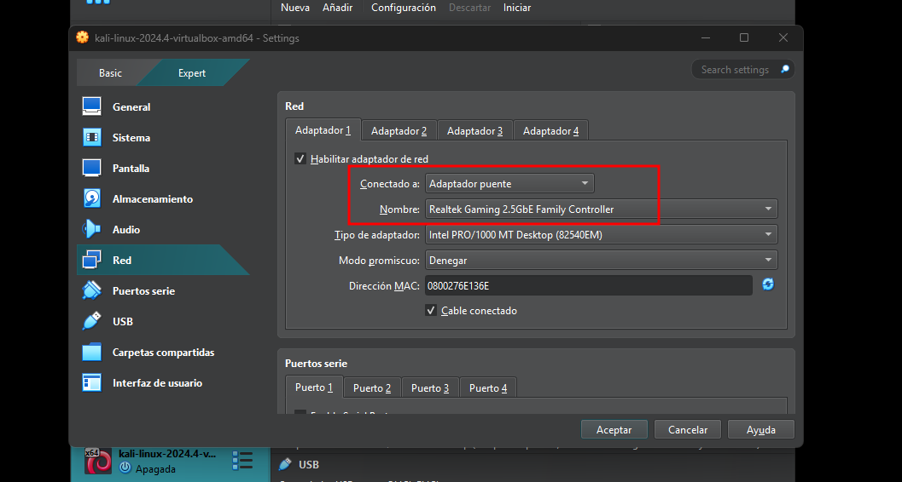

*Captura 2.*

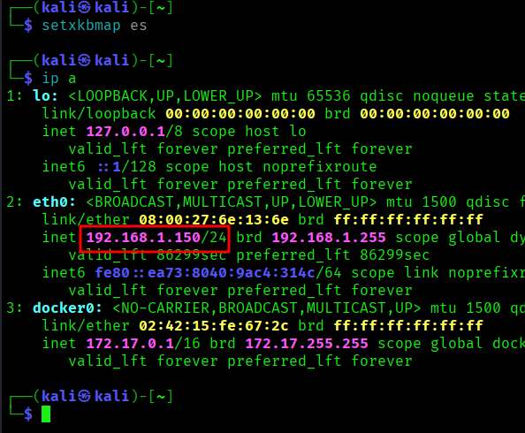

*Captura 3.*

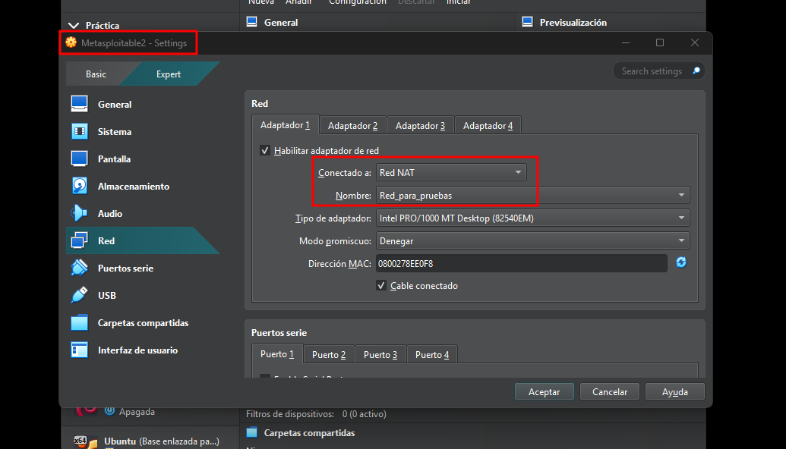

*Captura 4.*

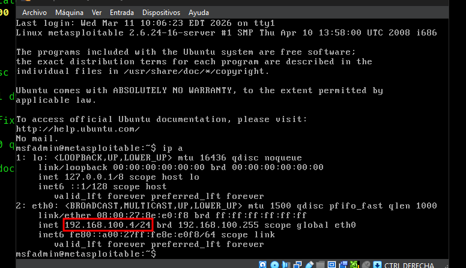

*Captura 5.*

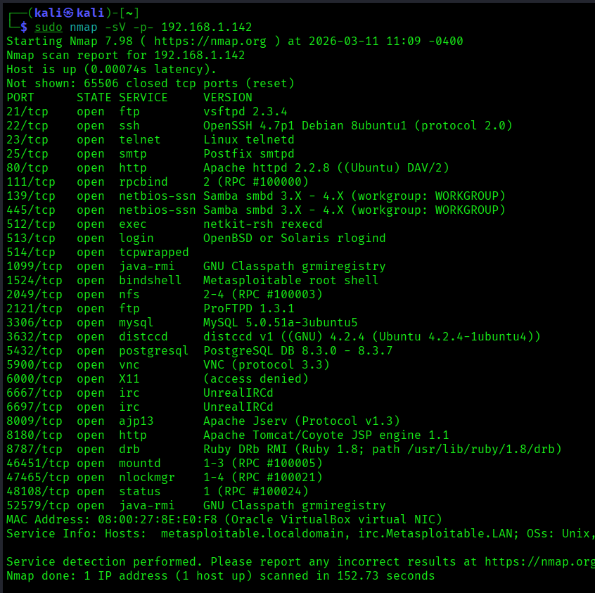

*Captura 6.*

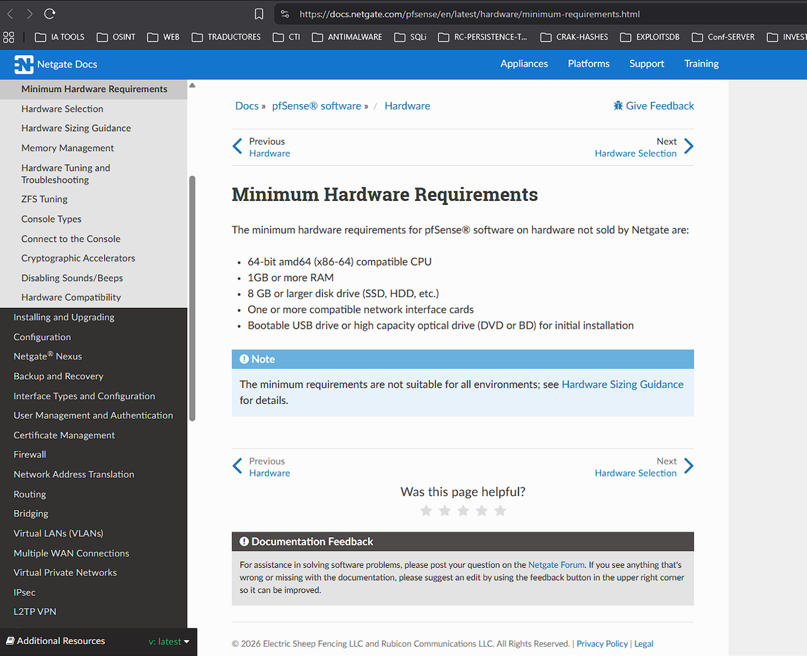

*Captura 7.*

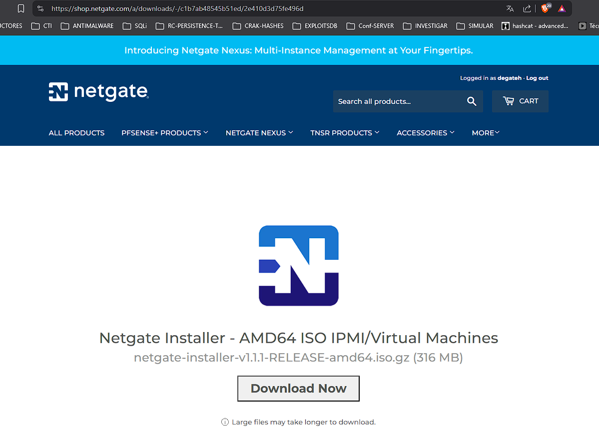

*Captura 8.*

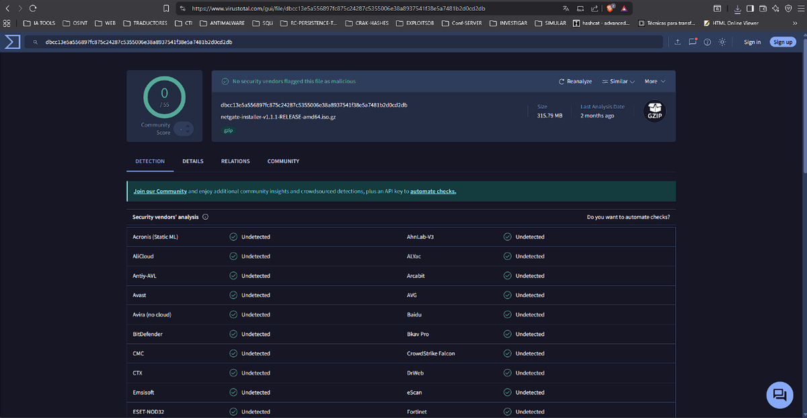

*Captura 9.*

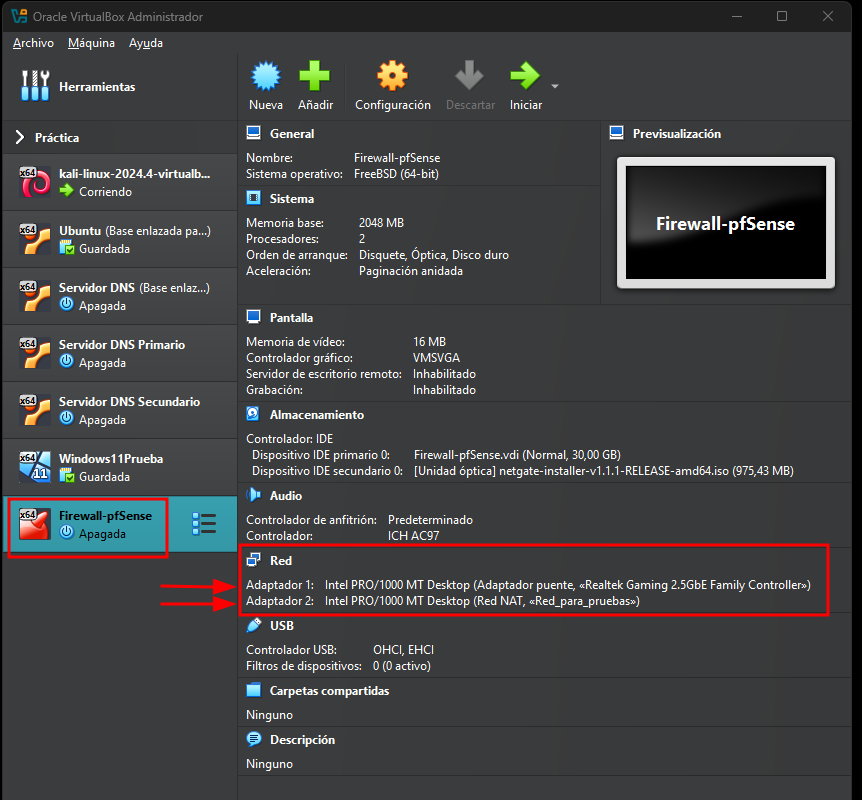

*Captura 10.*

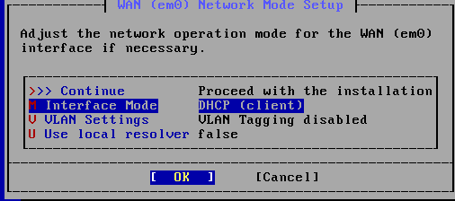

*Captura 11.*

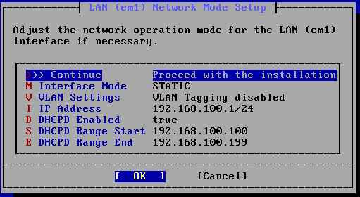

*Captura 12.*

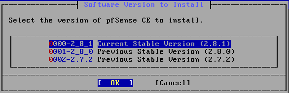

*Captura 13.*

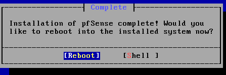

*Captura 14.*

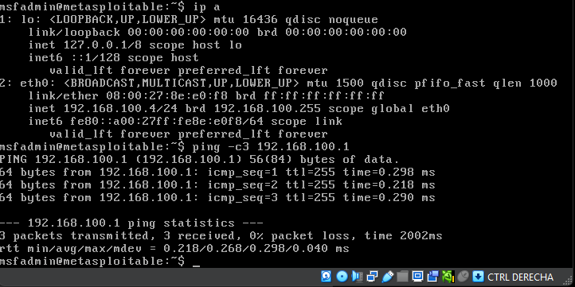

*Captura 15.*

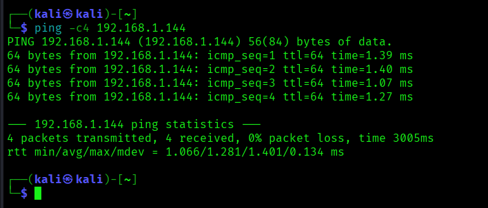

*Captura 16.*

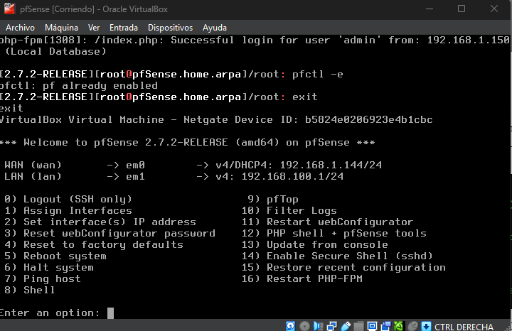

*Captura 17.*

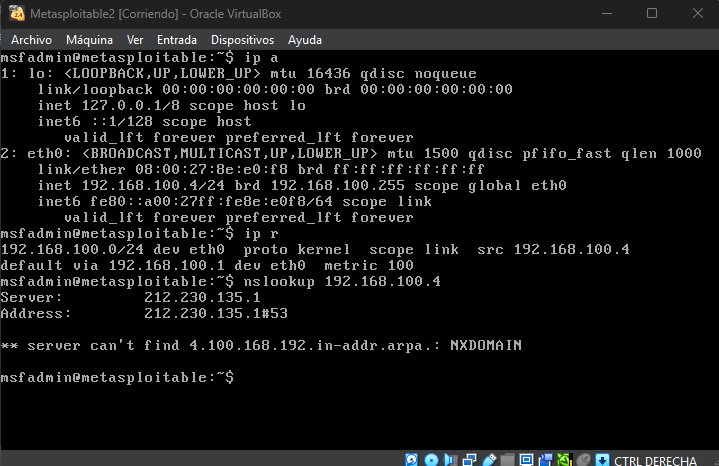

*Captura 18.*

## Resumen

Esta práctica es especialmente útil para portfolio porque demuestra conocimiento de red, segmentación, firewalling e inspección de tráfico, no solo explotación de máquinas vulnerables.
