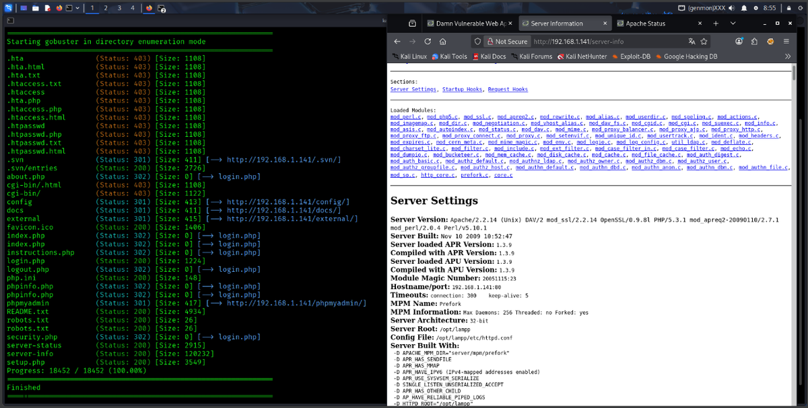
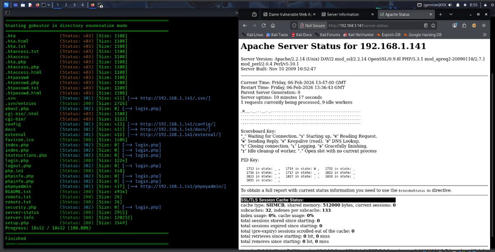
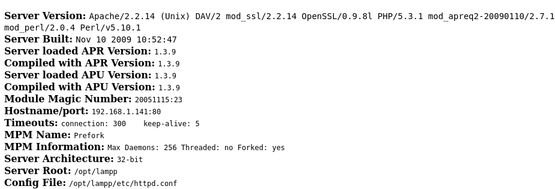
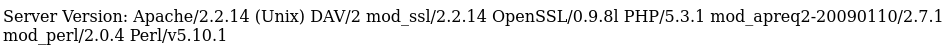
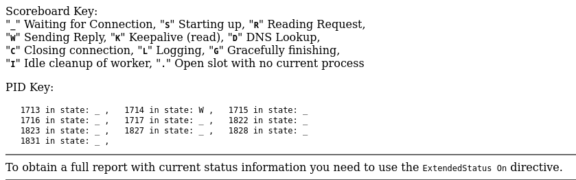
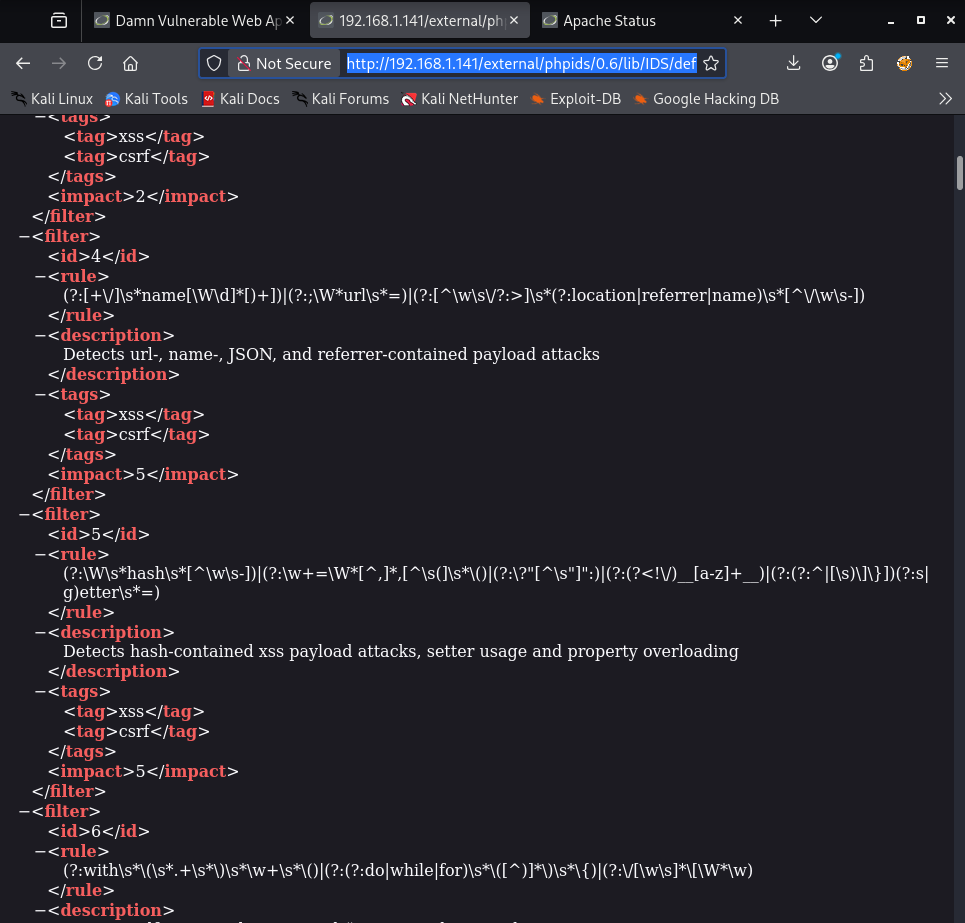

# DVWA - Reconocimiento de tecnologías expuestas

> Laboratorio/documentación realizada en entorno local o controlado con fines educativos. No ejecutar estas técnicas contra sistemas ajenos o sin autorización.


## Objetivo

Analizar información técnica expuesta por DVWA y el servidor web mediante rutas como `/server-info` y `/server-status`.

## Rutas revisadas

```text
http://192.168.1.141/server-info
http://192.168.1.141/server-status
```

## Hallazgos documentados

| Categoría | Información observada |
|---|---|
| Sistema | Unix / Linux |
| Arquitectura | 32-bit |
| Stack | XAMPP/LAMPP |
| Servidor web | Apache 2.2.14 |
| PHP | 5.3.1 |
| Rutas sensibles | `/server-info`, `/server-status`, `/phpmyadmin` |

## Riesgo

Exponer información de configuración facilita el fingerprinting del sistema y ayuda a seleccionar vulnerabilidades concretas según versiones, módulos y rutas internas.

## Medidas defensivas

- Deshabilitar `mod_info` si no es imprescindible.
- Restringir `/server-status` por IP o eliminarlo.
- No exponer paneles administrativos públicamente.
- Actualizar software obsoleto.
- Evitar mostrar rutas internas del servidor.

## Evidencias visuales




*Captura 1.*



*Captura 2.*



*Captura 3.*



*Captura 4.*



*Captura 5.*



*Captura 6.*

## Resumen

El reconocimiento de tecnologías no explota por sí mismo, pero reduce la incertidumbre del atacante. Por eso la exposición de versiones, módulos y rutas internas debe tratarse como un riesgo real.
