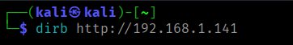
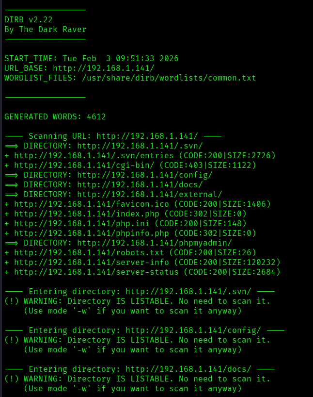
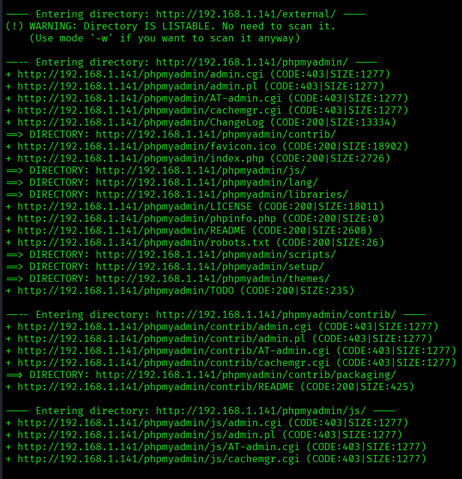
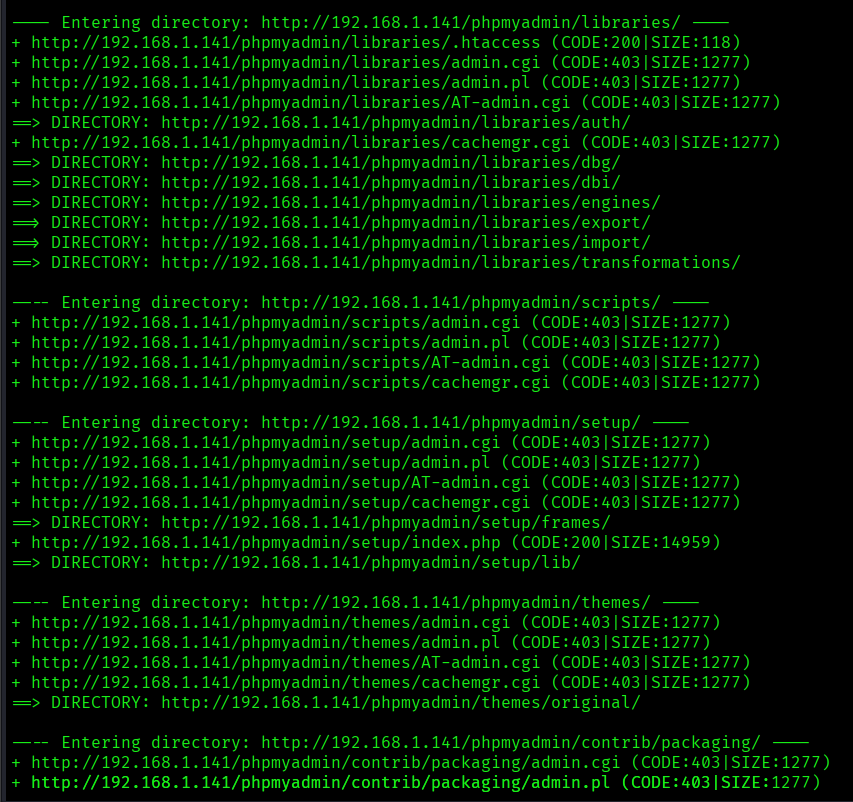
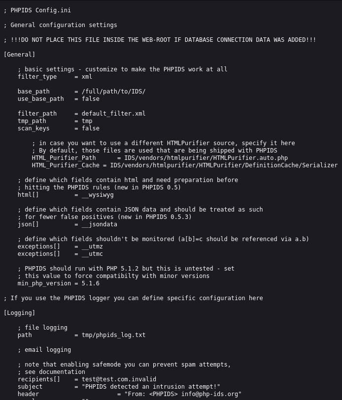
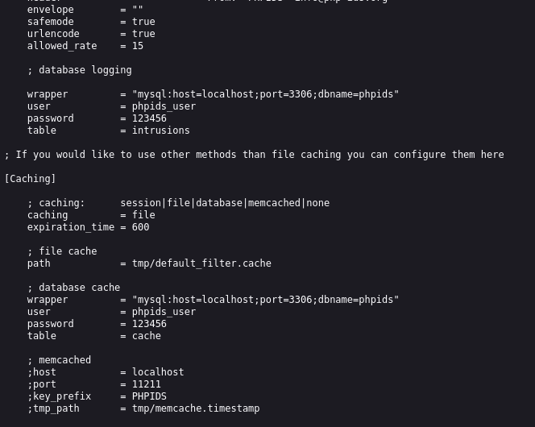
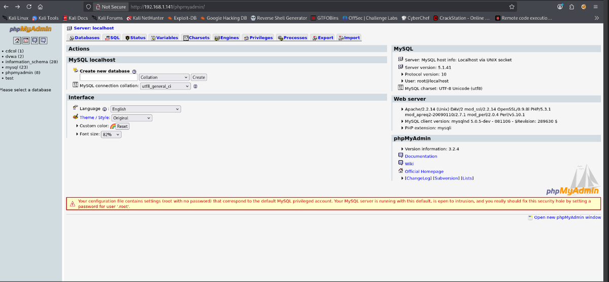
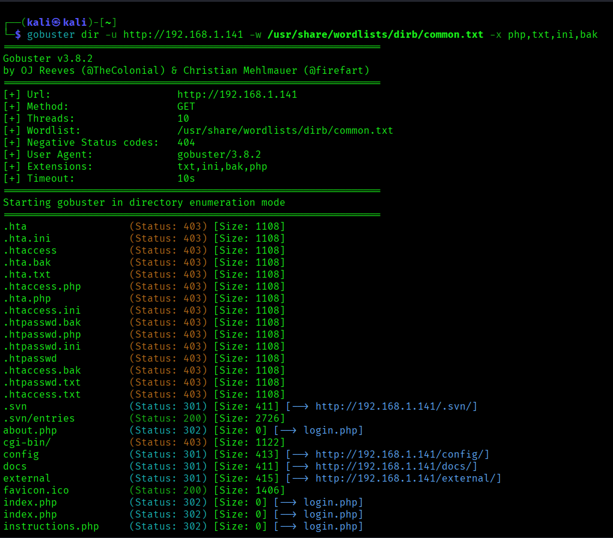
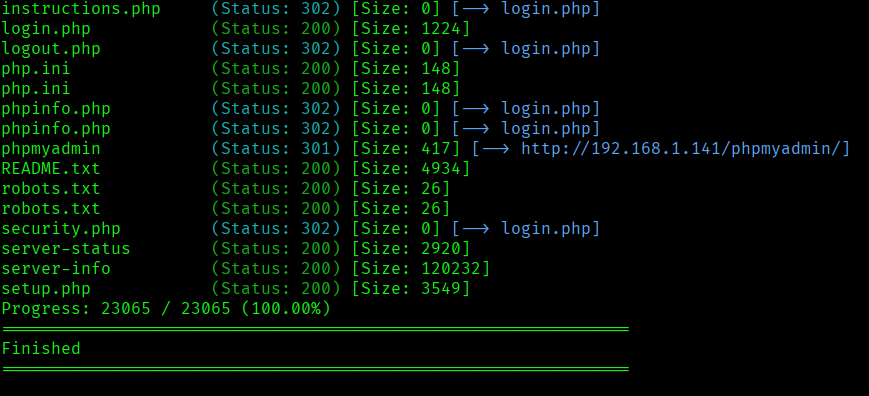
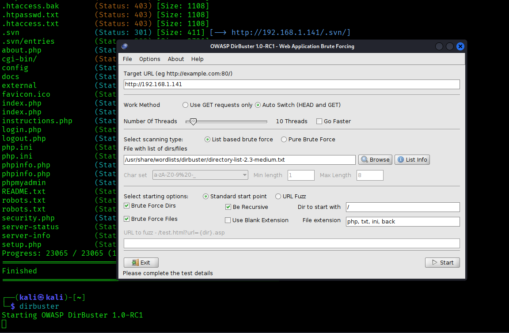

# DVWA - Fuzzing web con DIRB, Gobuster y DirBuster

> Laboratorio/documentación realizada en entorno local o controlado con fines educativos. No ejecutar estas técnicas contra sistemas ajenos o sin autorización.


## Objetivo

Documentar una práctica de enumeración web sobre DVWA usando herramientas de fuzzing para descubrir rutas, archivos sensibles y paneles de administración expuestos.

## Entorno

| Campo | Valor |
|---|---|
| Máquina | DVWA |
| IP de laboratorio | `192.168.1.141` |
| Herramientas | `dirb`, `gobuster`, `dirbuster` |
| Riesgos observados | Directorios listables, configuración expuesta, phpMyAdmin accesible, ficheros sensibles |

## 1. Enumeración con DIRB

```bash
dirb http://192.168.1.141
```

El objetivo es descubrir rutas comunes, directorios accesibles y ficheros que no aparecen enlazados desde la navegación normal.

## 2. Hallazgos relevantes

Durante la práctica se localizaron recursos sensibles como:

```text
/phpmyadmin/
/server-info
/server-status
/config/
/external/phpids/0.6/lib/IDS/Config/Config.ini
/.svn/
```

Estos hallazgos indican una mala configuración del servidor porque exponen información útil para un atacante durante la fase de reconocimiento.

## 3. Enumeración con Gobuster

```bash
gobuster dir -u http://192.168.1.141 -w /usr/share/wordlists/dirb/common.txt -x php,txt,ini,bak
```

Parámetros principales:

| Parámetro | Uso |
|---|---|
| `dir` | Modo de enumeración de directorios y archivos. |
| `-u` | URL objetivo. |
| `-w` | Diccionario usado. |
| `-x` | Extensiones a probar. |

## 4. Impacto defensivo

Los resultados muestran por qué es importante:

- Deshabilitar listados de directorios.
- No publicar ficheros de configuración.
- Proteger phpMyAdmin y paneles administrativos.
- Deshabilitar `/server-info` y `/server-status` salvo necesidad justificada.
- Eliminar carpetas `.svn`, `.git` o copias de seguridad del servidor web.

## Evidencias visuales




*Inicio del escaneo con DIRB.*



*Resultados de directorios detectados.*



*Rutas adicionales localizadas.*



*Archivo de configuración expuesto.*



*Acceso a phpMyAdmin.*



*Uso de Gobuster.*



*Resultados de Gobuster.*



*Ejecución de DirBuster.*



*Resultados visuales en herramienta gráfica.*



*Resumen de hallazgos.*

## Resumen

El fuzzing web permite detectar rápidamente rutas y ficheros expuestos. En una auditoría defensiva, estos resultados ayudan a priorizar correcciones de configuración antes de que se conviertan en vectores de intrusión.
