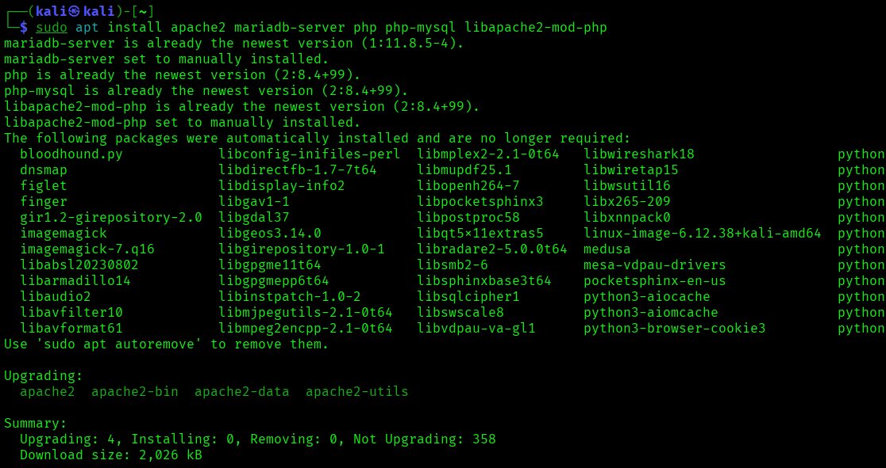
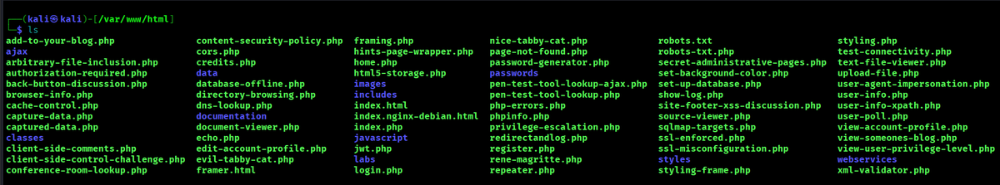
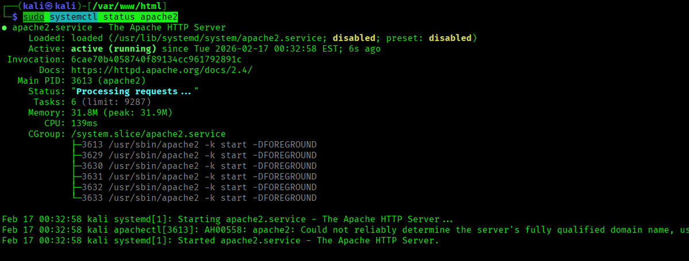
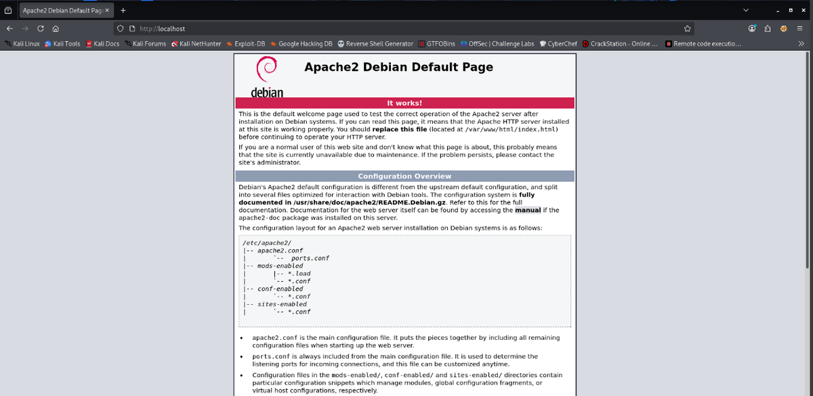
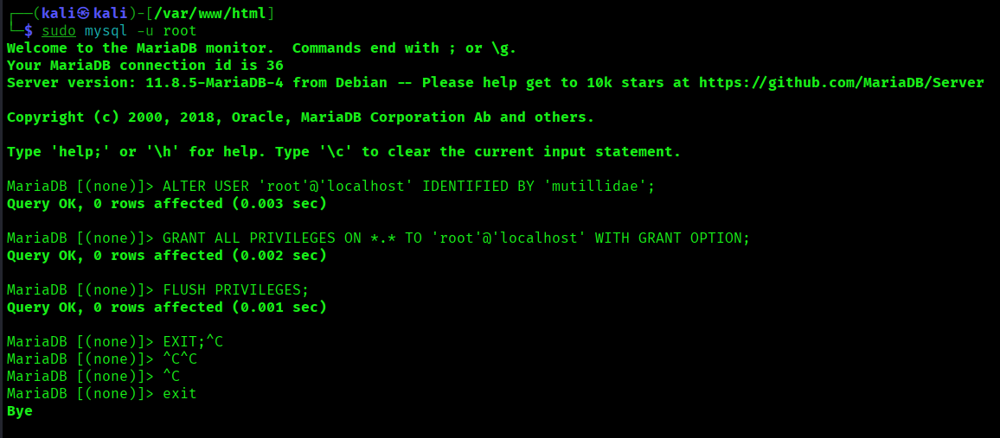
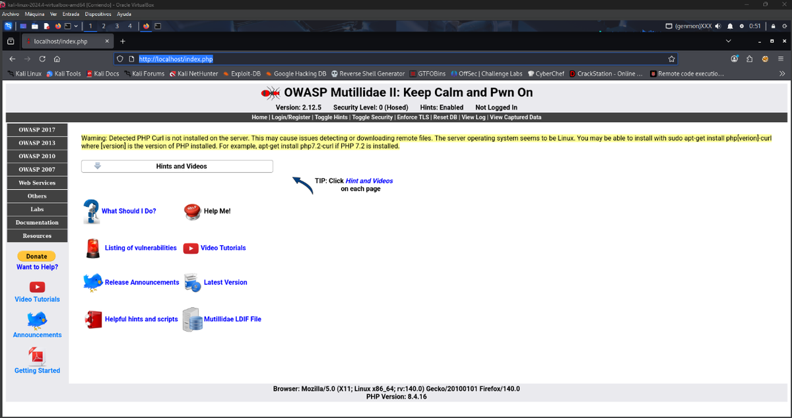

# Kali - Instalación de Mutillidae 2

> Laboratorio/documentación realizada en entorno local o controlado con fines educativos. No ejecutar estas técnicas contra sistemas ajenos o sin autorización.


## Objetivo

Instalar Mutillidae 2 en Kali Linux para disponer de una aplicación web vulnerable de laboratorio.

## 1. Actualización e instalación de dependencias

```bash
sudo apt update
sudo apt install apache2 mariadb-server php php-mysql libapache2-mod-php
```

## 2. Descarga del proyecto

```bash
sudo git clone https://github.com/webpwnized/mutillidae.git
```

## 3. Despliegue en Apache

```bash
sudo mv /var/www/html/mutillidae/src/* /var/www/html/
sudo rm -rf /var/www/html/mutillidae
sudo chown -R www-data:www-data /var/www/html/
sudo chmod -R 755 /var/www/html/
```

## 4. Servicios necesarios

```bash
sudo systemctl start apache2
sudo systemctl start mariadb
sudo systemctl status apache2
sudo systemctl status mariadb
```

## 5. Acceso

```text
http://localhost/
```

## Recomendación

Mantener Mutillidae aislado en laboratorio. No exponerlo a internet ni a una red compartida, ya que está diseñado para ser vulnerable.

## Evidencias visuales




*Captura 1.*



*Captura 2.*



*Captura 3.*



*Captura 4.*



*Captura 5.*



*Captura 6.*

## Resumen

Mutillidae permite practicar vulnerabilidades web en un entorno controlado. La instalación debe realizarse siempre en una máquina aislada o entorno de laboratorio.
