# Muña - Instalación, ataque y defensa

> Laboratorio/documentación realizada en entorno local o controlado con fines educativos. No ejecutar estas técnicas contra sistemas ajenos o sin autorización.


## Objetivo

Documentar una práctica completa sobre la aplicación Muña: instalación, configuración de base de datos, pruebas de inyección SQL y aplicación de defensas básicas.

## 1. Instalación y configuración

Se prepara el entorno web en Kali, se ajustan permisos y se importa la base de datos de la aplicación.

```bash
mysql -u root
chown -R www-data:www-data /var/www/html/muna
chmod -R 755 /var/www/html/muna
nano /var/www/html/muna/conexion.inc
```

Acceso local:

```text
http://localhost/muna
```

## 2. Pruebas de inyección SQL en laboratorio

Ejemplos usados para comprobar la falta de validación en formularios de autenticación:

```sql
' OR '1'='1
' OR ''='
' or true --
' OR '1'='1' --
```

## 3. Defensa aplicada

La práctica incluye medidas de mitigación como sanitización de entradas y uso de consultas parametrizadas.

Ejemplo conceptual:

```php
$cuenta = $this->sanatizar($cuenta);
$clave = $this->sanatizar($clave);
```

La defensa más robusta es evitar concatenar datos del usuario en SQL y usar consultas preparadas.

## Medidas defensivas recomendadas

- Validar entradas por tipo, longitud y formato.
- Usar consultas parametrizadas.
- No mostrar errores SQL al usuario.
- Aplicar mínimos privilegios al usuario de base de datos.
- Registrar intentos anómalos de autenticación.

## Evidencias visuales


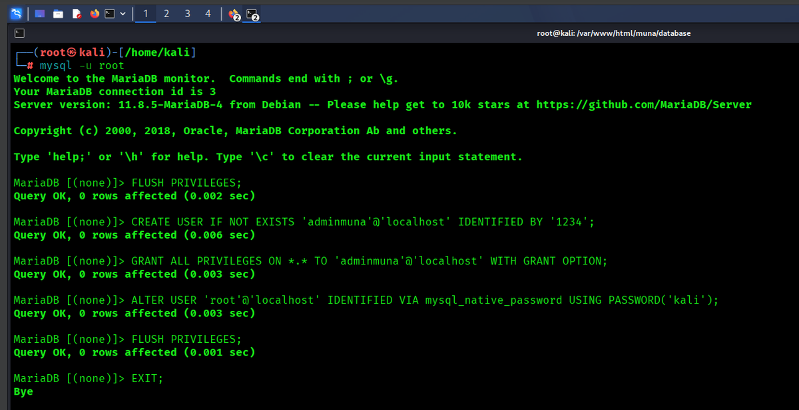

*Captura 1.*

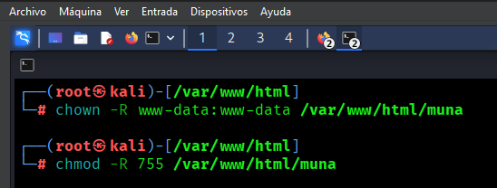

*Captura 2.*

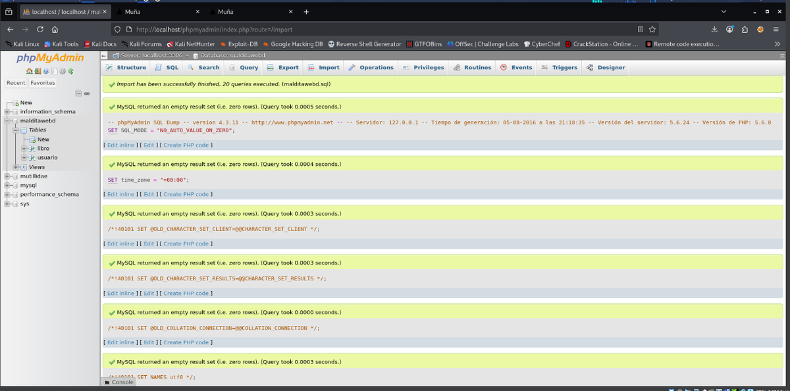

*Captura 3.*

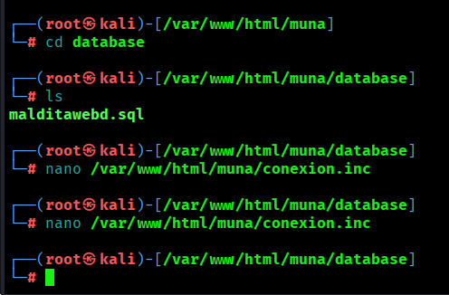

*Captura 4.*

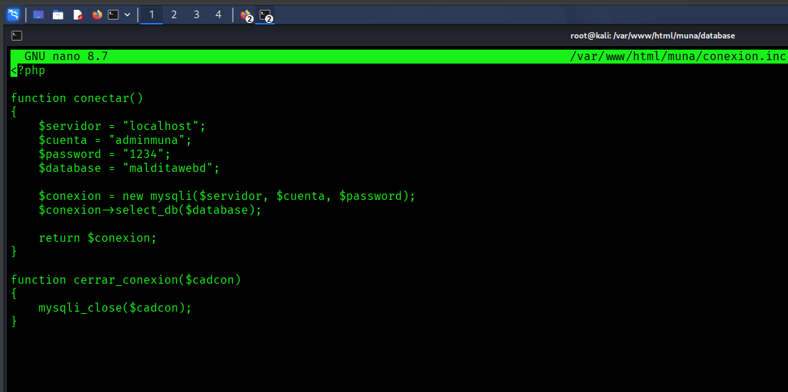

*Captura 5.*

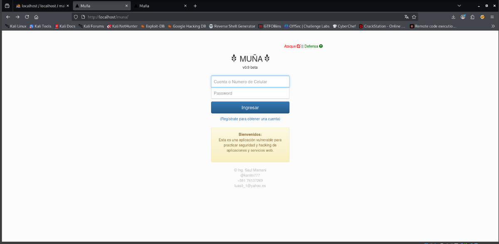

*Captura 6.*

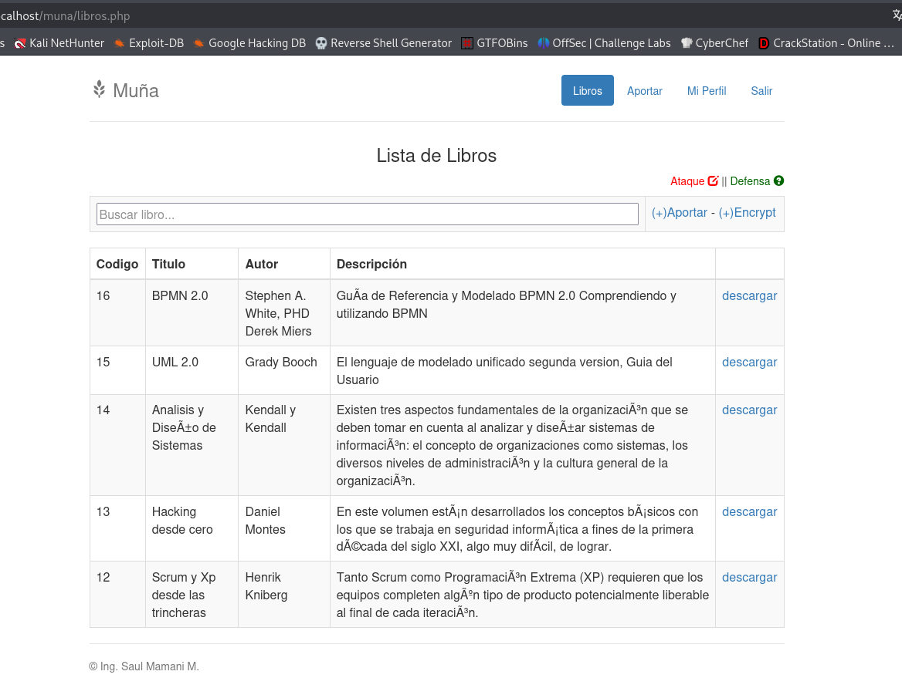

*Captura 7.*

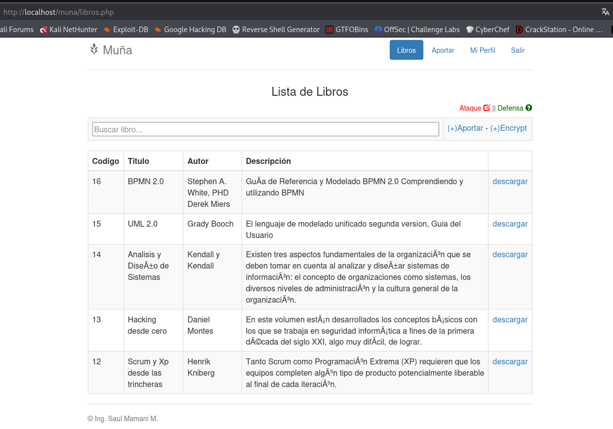

*Captura 8.*

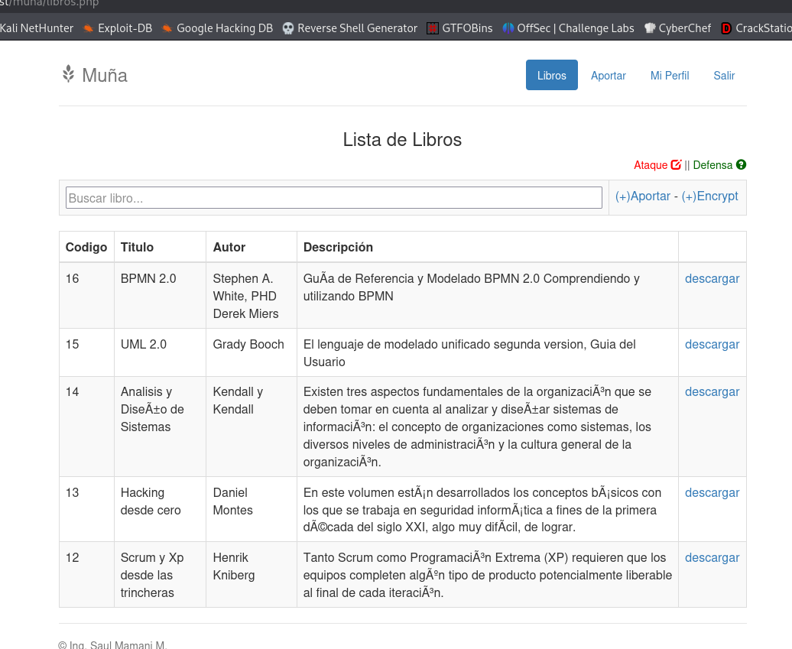

*Captura 9.*

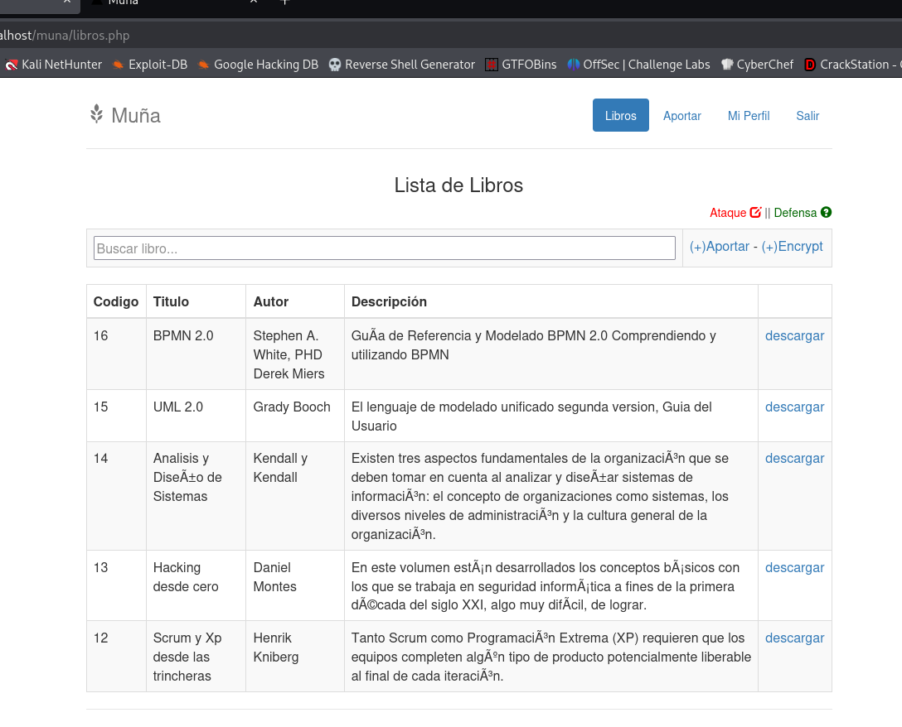

*Captura 10.*

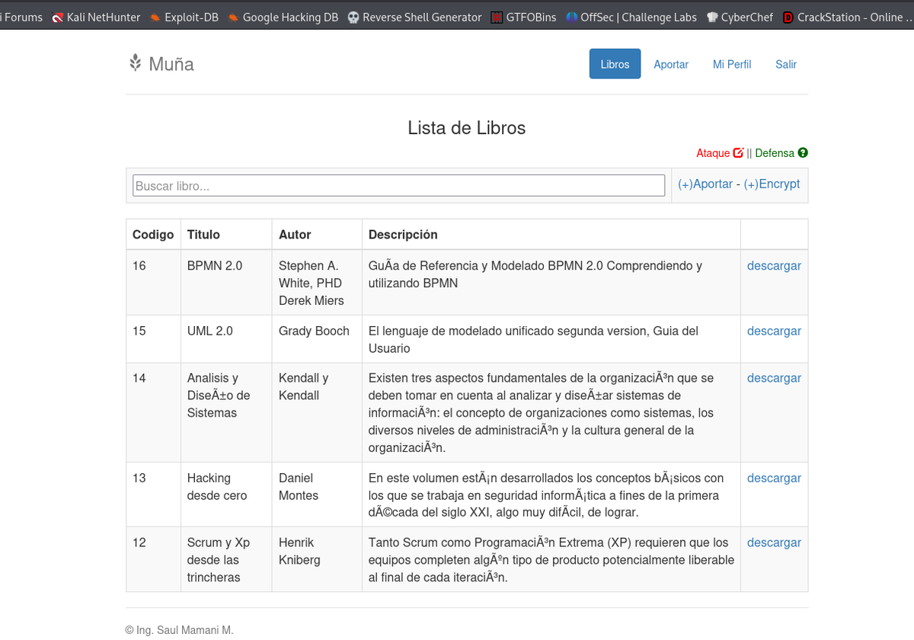

*Captura 11.*

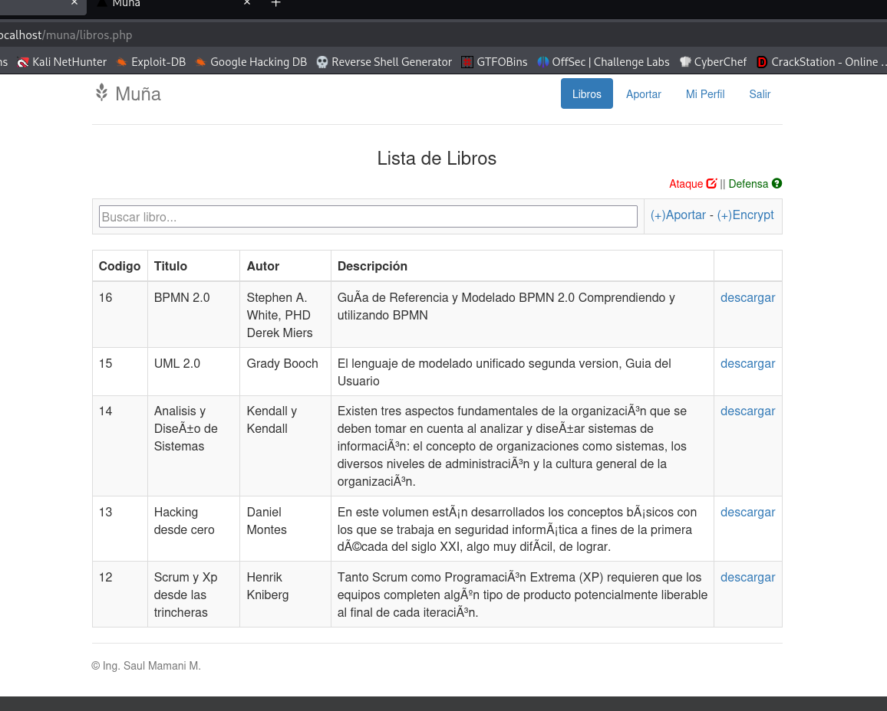

*Captura 12.*

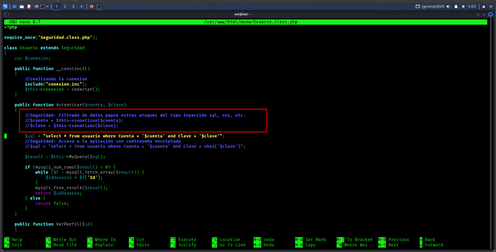

*Captura 13.*

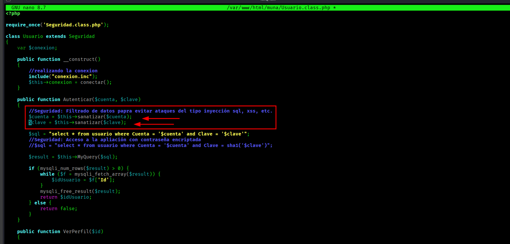

*Captura 14.*

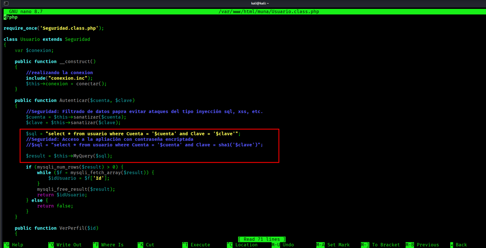

*Captura 15.*

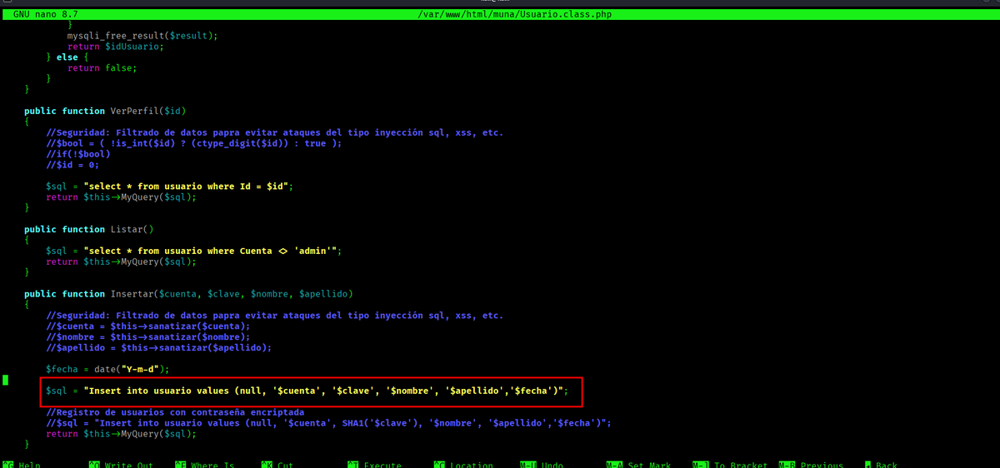

*Captura 16.*

## Resumen

Muña es una buena práctica porque une ataque y defensa. No basta con demostrar la inyección SQL; el valor profesional está en documentar cómo se corrige.
