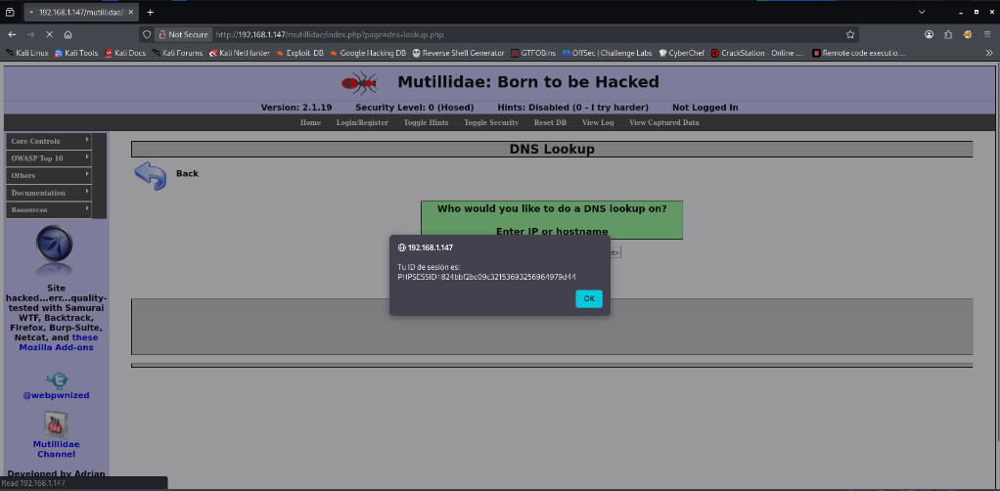
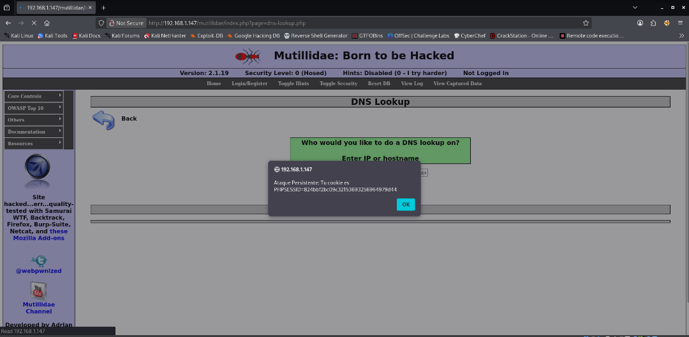
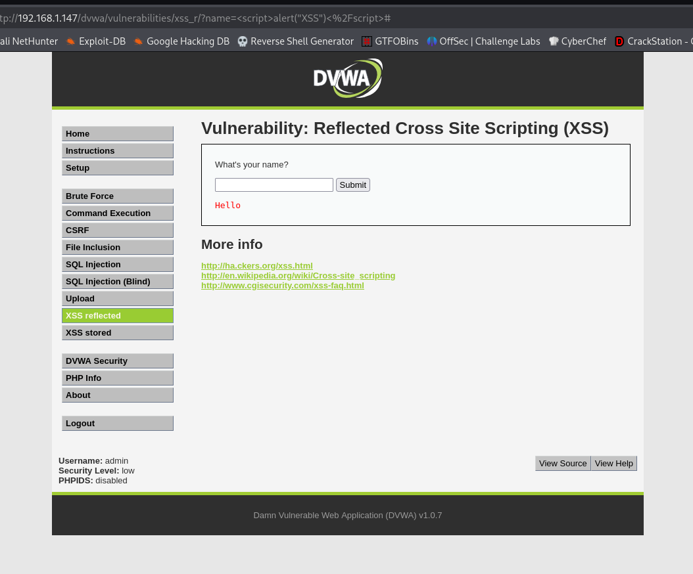
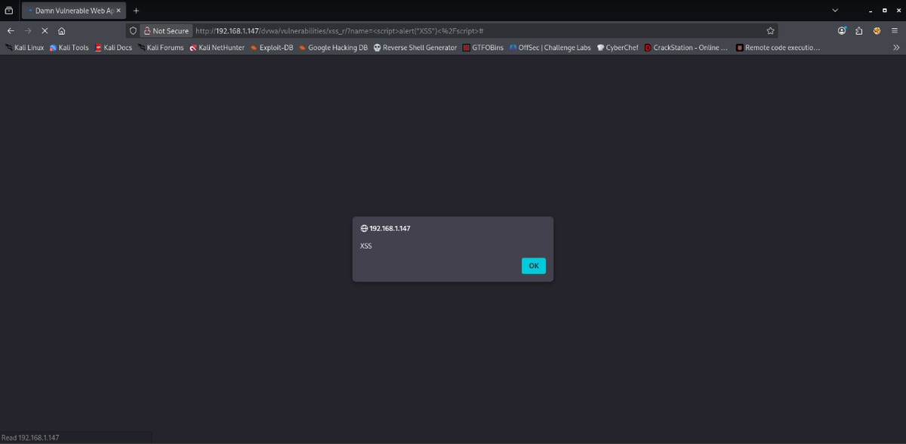
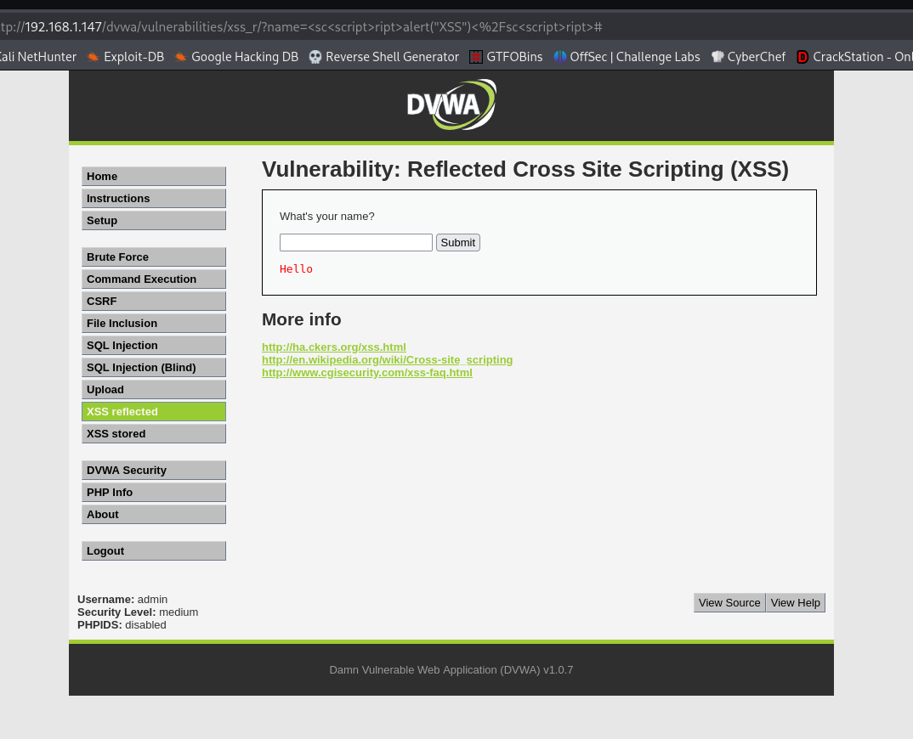
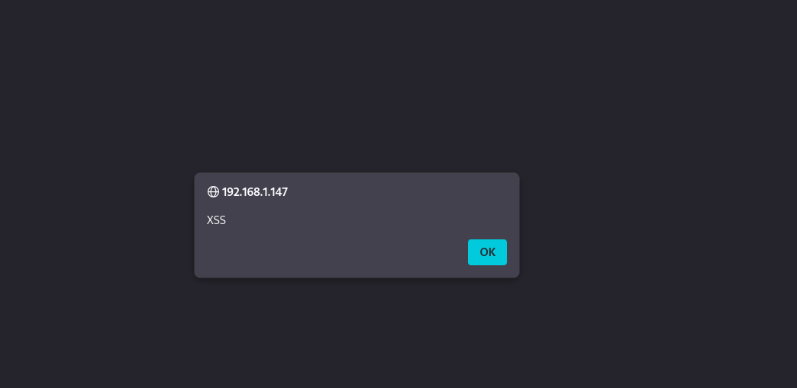
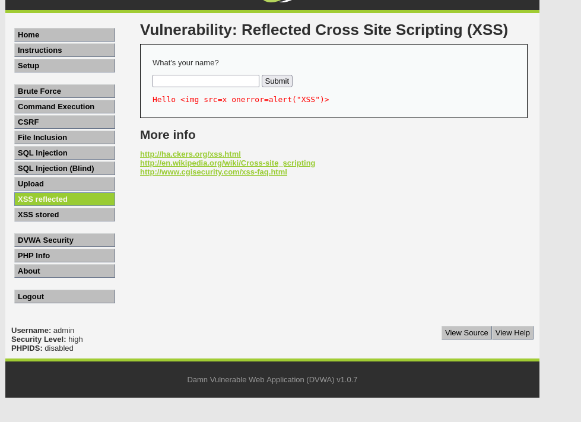

# XSS - Pruebas en DVWA y Mutillidae

> Laboratorio/documentación realizada en entorno local o controlado con fines educativos. No ejecutar estas técnicas contra sistemas ajenos o sin autorización.


## Objetivo

Documentar pruebas controladas de Cross-Site Scripting en DVWA y Mutillidae para comprender el impacto de ejecutar JavaScript no autorizado en el navegador del usuario.

## Mutillidae

Ejemplo de prueba reflejada/persistente en laboratorio:

```html
<script>alert("Tu ID de sesión es: " + document.cookie);</script>
```

El objetivo didáctico es demostrar que el navegador ejecuta código inyectado dentro del contexto de la página vulnerable.

## DVWA

Ejemplo básico:

```html
<script>alert("XSS")</script>
```

Ejemplo de evasión de filtro débil:

```html
<sc<script>ript>alert("XSS")</sc<script>ript>
```

## Riesgo

Un XSS puede permitir robo de cookies no protegidas, manipulación del DOM, redirecciones, ejecución de acciones en nombre del usuario y captura de información mostrada en la sesión.

## Medidas defensivas

- Escapar salida según contexto: HTML, atributo, JavaScript, URL.
- Validar entradas de usuario.
- Usar `HttpOnly`, `Secure` y `SameSite` en cookies.
- Implementar Content Security Policy.
- Evitar filtros basados solo en reemplazar palabras como `script`.

## Evidencias visuales




*Captura 1.*



*Captura 2.*



*Captura 3.*



*Captura 4.*



*Captura 5.*



*Captura 6.*



*Captura 7.*

## Resumen

La práctica muestra que bloquear cadenas concretas no es suficiente. La defensa eficaz contra XSS requiere codificación contextual, cabeceras de seguridad y diseño seguro de formularios.
